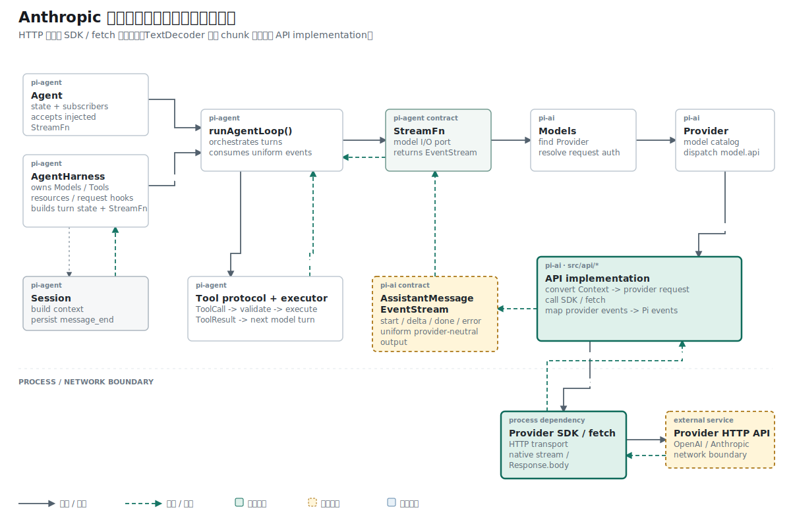

## 名词约定：网络边界不会替上层保留文本结构

| 名称 | 本文含义 |
| --- | --- |
| `ReadableStream<Uint8Array>` | HTTP Response body 暴露的异步字节流 |
| chunk | 一次 `reader.read()` 返回的任意大小字节块，不保证字符、行或事件完整 |
| `TextDecoder` | 把 UTF-8 字节持续恢复为 JavaScript 字符串的标准对象 |
| buffer | 保存已解码但尚未形成完整文本行的字符串 |
| SSE state | 保存完整行已经提供、但空行尚未结束的当前帧状态 |
| wrapper | 发起 Anthropic 请求并把 `Response.body` 交给读取器的外层请求函数 |

decoder、buffer 与 SSE state 分别保护字符、行和帧边界；任何一个都不能代替另外两个。

## 结论先行

本篇主张：网络 chunk、UTF-8 字符、文本行和 SSE 帧是四种独立边界；读取器必须按“字节解码、行恢复、帧恢复”的顺序逐层稳定输入。

推理链如下：

```text
前提 1：ReadableStream 只保证 Uint8Array chunk，不保证字符或行完整。
前提 2：decodeSseLine() 只接受完整文本行。
结论 1：二者之间必须增加持续的 TextDecoder 与文本 buffer。

前提 3：网络结束时 decoder、buffer 和 SSE state 都可能仍有残留。
前提 4：任一层残留未提交都会丢失尾部数据。
结论 2：流结束必须按层次 flush，并在 finally 中释放 reader lock。
```

## 已知事实：上一阶段以完整文本行为输入前提

上一阶段完成了 SSE 行解码器：

```ts
decodeSseLine(
  line: string,
  state: SseDecoderState,
): ServerSentEvent | null
```

它假设调用方已经提供完整文本行：

```text
event: message_start
data: {"type":"message_start"}
<空行>
```

单元测试直接创建 `string[]` 并逐行调用，因此这个前提在测试里始终成立。HTTP 网络层不提供文本行。标准 `Response.body` 的类型是：

```ts
ReadableStream<Uint8Array> | null
```

一次 `reader.read()` 返回一个二进制 chunk。chunk 大小由网络栈、TLS、运行时缓冲和服务端写入共同决定，和 SSE 行或事件没有固定对应关系。

## 概念约束：chunk、字符、行和帧互不等同

同一段响应同时存在四种切分方式：

```text
Uint8Array chunk
  -> UTF-8 text
  -> text line
  -> ServerSentEvent
```

它们的边界可以错开：

```text
chunk 1: event: message_
chunk 2: start\ndata: {"type":"message
chunk 3: _start"}\n\n
```

SSE 语义仍然是两条字段行加一个空行，但网络把第一条行、第二条行和 JSON 字符串都拆开了。

另一个边界发生在 UTF-8 内部。中文字符通常占多个字节，一个 chunk 可能以字符的前两个字节结束，下一个 chunk 才提供剩余字节。直接对每个 chunk 独立解码可能产生替换字符，后续拼接无法恢复原文。

这一阶段增加的读取器负责把不稳定的网络边界转换成上一阶段要求的稳定行边界。

## 反例：直接按 chunk 解析会破坏哪些边界

如果把每次读取的内容直接交给 `decodeSseLine()`：

```ts
const { value } = await reader.read();
const line = new TextDecoder().decode(value);
decodeSseLine(line, state);
```

上面的三个示例 chunk 会被误判成：

```text
字段名 event，值 message_ 后面还缺内容
一行中混入 event 尾部、换行和半段 data
字段名 _start"}\n\n
```

如果先对每个 chunk 执行 `split("\n")`，chunk 尾部那条未完成行也会过早进入解码器。下一块到达时已经无法和前半行重新组合。

如果直接查找 `\n\n`，还会遗漏 `\r\n\r\n`、跨 chunk 空行和尚未完成的 UTF-8 字符。

## 问题定义：读取器必须连续完成四项转换

读取器需要连续完成四项工作：

```text
1. 从 ReadableStream 读取 Uint8Array
2. 用同一个 TextDecoder 持续恢复 UTF-8 文本
3. 把未完成行留在 buffer
4. 只把完整行交给 decodeSseLine()
```

网络结束时还要处理三种残留：

```text
TextDecoder 内部残留字节
buffer 中没有换行的最后一行
SseDecoderState 中没有空行终止的最后一帧
```

任何一层遗漏 flush，都可能丢掉响应尾部。

## 机制一：建立持续读取上下文

`iterateSseMessages()` 初始化 reader、decoder、SSE state 和文本 buffer：

```ts
export async function* iterateSseMessages(
  body: ReadableStream<Uint8Array>,
  signal?: AbortSignal,
): AsyncGenerator<ServerSentEvent> {
  const reader = body.getReader();
  const decoder = new TextDecoder();
  const state: SseDecoderState = {
    event: null,
    data: [],
    raw: [],
  };

  let buffer = "";

  // read loop 与尾部处理
}
```

四个对象各自保存一种跨读取状态：

| 对象 | 保存的内容 |
| --- | --- |
| `reader` | 对 `Response.body` 的独占读取权 |
| `decoder` | 未组成完整 UTF-8 字符的字节 |
| `buffer` | 已解码但尚未形成完整行的文本 |
| `state` | 已形成完整行但尚未遇到空行的 SSE 帧 |

这四种状态不能合并成一个字符串。`TextDecoder` 处理编码边界，`buffer` 处理换行边界，`SseDecoderState` 处理帧边界。

## 机制二：流式解码 UTF-8

主循环每次读取一个 chunk：

```ts
while (true) {
  if (signal?.aborted) {
    throw new Error("Request was aborted");
  }

  const { value, done } = await reader.read();

  if (done) {
    break;
  }

  buffer += decoder.decode(value, { stream: true });

  // 从 buffer 消费完整行
}
```

同一个 `TextDecoder` 被反复使用。`{ stream: true }` 告诉 decoder 后续还会有字节；如果 chunk 在一个多字节字符中间结束，decoder 会保存未完成字节，等下一次 `decode()` 再输出字符。

下面的伪例说明两层缓冲的差别：

```text
chunk 1 bytes
  -> decoder 保留半个 UTF-8 字符
  -> buffer 收到此前已经完整的文本

chunk 2 bytes
  -> decoder 拼出完整字符
  -> buffer 继续等待换行
```

当前自动测试只使用 ASCII 文本，没有把中文字符的字节拆到两个 chunk。代码具备流式解码路径，跨 chunk 多字节字符仍缺少聚焦测试。

## 机制三：识别三种换行

SSE 文本可能使用 `\n`、`\r` 或 `\r\n`。辅助函数寻找最早出现的换行字符：

```ts
function nextLineBreakIndex(text: string): number {
  const carriageReturnIndex = text.indexOf("\r");
  const newlineIndex = text.indexOf("\n");

  if (carriageReturnIndex === -1) {
    return newlineIndex;
  }

  if (newlineIndex === -1) {
    return carriageReturnIndex;
  }

  return Math.min(carriageReturnIndex, newlineIndex);
}
```

返回最小索引很重要。buffer 可能同时包含多行，读取器必须从最前面的边界开始消费，不能因为后面先搜索到另一种换行而跳过文本。

`consumeLine()` 取出换行前的文本，并返回剩余 buffer：

```ts
function consumeLine(
  text: string,
): { line: string; rest: string } | null {
  const lineBreakIndex = nextLineBreakIndex(text);

  if (lineBreakIndex === -1) {
    return null;
  }

  let nextIndex = lineBreakIndex + 1;

  if (
    text[lineBreakIndex] === "\r" &&
    text[nextIndex] === "\n"
  ) {
    nextIndex += 1;
  }

  return {
    line: text.slice(0, lineBreakIndex),
    rest: text.slice(nextIndex),
  };
}
```

例如：

```ts
consumeLine("event: message_start\r\ndata: {...}")
```

返回：

```ts
{
  line: "event: message_start",
  rest: "data: {...}",
}
```

当 buffer 没有任何换行时，函数返回 `null`。这段文本继续保留，等待下一个 chunk 补齐。

当前实现能在同一个 buffer 中把 `\r\n` 当作一个换行。如果 `\r` 位于一个 chunk 末尾、`\n` 位于下一个 chunk 开头，主循环可能先把 `\r` 消费掉，随后把开头的 `\n` 视为空行。这个拆分边界尚无测试保护。

## 机制四：持续消费一个 chunk 中的多行

一个 chunk 也可能携带多个完整事件。代码用循环持续消费 buffer：

```ts
let consumed = consumeLine(buffer);

while (consumed) {
  buffer = consumed.rest;

  const event = decodeSseLine(
    consumed.line,
    state,
  );

  if (event) {
    yield event;
  }

  consumed = consumeLine(buffer);
}
```

这里复用了上一阶段的行状态机：

```text
buffer
  -> consumeLine()
  -> complete line
  -> decodeSseLine()
  -> null 或 ServerSentEvent
```

读取器不解析 `event` 名称和 JSON，帧解码器也不读取网络。每层只消费已经稳定的输入单位。

## 终止条件：为什么结束时要逐层 flush

`reader.read()` 返回 `done: true` 只表示网络不会再提供 chunk。各层仍可能保存数据。

第一步，结束 TextDecoder 的流式状态：

```ts
buffer += decoder.decode();
```

无参数 `decode()` 会提交 decoder 内部残留。如果响应在非法或不完整 UTF-8 序列中结束，默认 decoder 行为会产生替换字符；当前代码没有启用 `{ fatal: true }`。

第二步，继续消费 decoder flush 后形成的完整行：

```ts
let consumed = consumeLine(buffer);

while (consumed) {
  buffer = consumed.rest;
  const event = decodeSseLine(consumed.line, state);
  if (event) yield event;
  consumed = consumeLine(buffer);
}
```

第三步，处理没有换行符的最后一行：

```ts
if (buffer.length > 0) {
  const event = decodeSseLine(buffer, state);

  if (event) {
    yield event;
  }
}
```

第四步，处理没有空行终止的最后一帧：

```ts
const trailingEvent = flushSseEvent(state);

if (trailingEvent) {
  yield trailingEvent;
}
```

从实现动作看共有三种数据 flush：decoder、buffer、SSE state。buffer 内部先重复消费完整行，再提交无换行尾行，所以代码块分成四段。

一个没有标准尾部空行的响应仍能交付最后一帧：

```text
event: message_stop
data: {"type":"message_stop"}
<连接关闭，没有空行>
```

如果省略 `flushSseEvent(state)`，这帧会一直停留在 state 中。

## 取消边界：AbortSignal 当前只能轮询检查

读取循环在每次 `reader.read()` 之前检查：

```ts
if (signal?.aborted) {
  throw new Error("Request was aborted");
}
```

这可以在两次读取之间停止后续解析。当前函数没有把 signal 绑定到 `reader.cancel()`，也没有让已经挂起的 `reader.read()` 立即退出。因此它提供的是轮询式取消检查，完整的网络取消还需要由创建 `fetch()` 或 SDK request 的上层传递同一个 signal。

参考 Pi 在 SDK 请求选项和 `iterateAnthropicEvents()` 中都传递 `options.signal`：请求层负责中断 HTTP，读取层负责在事件迭代期间检查状态。

## 资源不变式：finally 必须释放 reader lock

`body.getReader()` 会锁定 `ReadableStream`。无论正常结束、JSON 解析失败、取消还是调用方提前停止异步迭代，都要释放锁：

```ts
try {
  // read and yield
} finally {
  reader.releaseLock();
}
```

`finally` 会在 generator 正常完成和异常退出时运行。`releaseLock()` 释放独占读取权，但不会主动取消底层网络源；是否需要 `reader.cancel()` 是另一项资源策略，当前实现没有执行。

## 拓扑位置：读取器仍未进入当前 wrapper

参考 Pi 的 Anthropic 网络路径为：

```text
buildParams()
  -> client.messages.create(...).asResponse()
  -> response.body
  -> iterateSseMessages()
  -> iterateAnthropicEvents()
  -> content block state
  -> AssistantMessageEventStream
```

关键接线代码是：

```ts
const response = await client.messages
  .create(
    { ...params, stream: true },
    requestOptions,
  )
  .asResponse();

for await (const event of iterateAnthropicEvents(
  response,
  options?.signal,
)) {
  // message_start / content_block_delta / message_stop
}
```

学习实现继续使用 `fetch()` 时，接线形状如下。当前 `StreamOptions` 还没有 `signal` 字段，因此采用这段路径前需要先扩展请求选项：

```ts
const params = buildParams(model, context, options);

const response = await fetch(url, {
  method: "POST",
  headers,
  body: JSON.stringify(params),
  signal: options?.signal,
});

if (!response.ok) {
  throw new Error(await response.text());
}

if (!response.body) {
  throw new Error("Missing response body");
}

for await (const sse of iterateSseMessages(
  response.body,
  options?.signal,
)) {
  // 下一层解析 sse.data
}
```

当前仓库还没有这段调用。真实 `streamSimple()` 仍执行：

```ts
const data = (await res.json()) as AnthropicMessagesResponse;
```

所以 `iterateSseMessages()` 当前只在单元测试中运行。请求构造、字节读取和运行 wrapper 尚未组成闭环。

## 证据边界：测试故意制造跨 chunk 行

默认用例名为 `iterateSseMessages handles a line split across network chunks`，它把网络边界故意放在字段名和 JSON 字符串中间。

测试先创建一个可控的 `ReadableStream`：

```ts
function bodyFromChunks(
  chunks: string[],
): ReadableStream<Uint8Array> {
  const encoder = new TextEncoder();

  return new ReadableStream({
    start(controller) {
      for (const chunk of chunks) {
        controller.enqueue(encoder.encode(chunk));
      }

      controller.close();
    },
  });
}
```

输入故意把字段名和 JSON 拆到三个 chunk：

```ts
const body = bodyFromChunks([
  "event: message_",
  'start\ndata: {"type":"message',
  '_start"}\n\n',
]);
```

异步迭代器仍应输出一个完整帧：

```ts
const frames = [];

for await (const frame of iterateSseMessages(body)) {
  frames.push(frame);
}

assert.deepEqual(frames, [
  {
    event: "message_start",
    data: '{"type":"message_start"}',
    raw: [
      "event: message_start",
      'data: {"type":"message_start"}',
    ],
  },
]);
```

这项测试证明行被拆到多个 ASCII chunk 后仍能恢复，也间接证明空行可以触发帧提交。

## 未证命题：现有测试还没有覆盖什么

当前只有一项 `iterateSseMessages()` 测试。以下行为来自实现，但缺少自动回归：

- 一个 chunk 内包含多帧。
- UTF-8 多字节字符被拆在两个字节 chunk。
- `\r`、`\r\n` 与跨 chunk 的 `\r`/`\n`。
- 响应没有最后一个换行或空行。
- AbortSignal 在读取前已经取消。
- 读取过程中抛出异常后是否释放 lock。
- 调用方提前结束 `for await` 时的资源状态。

文章把这些边界列出，是为了区分“代码已有分支”和“测试已经证明”。当前 outcome 只覆盖跨 chunk 的 ASCII 行恢复。

## 缺失前提：SSE 帧还不是 Pi 事件

`iterateSseMessages()` 输出的数据仍属于 SSE：

```ts
{
  event: "content_block_delta",
  data: '{"type":"content_block_delta",...}',
  raw: [...],
}
```

Pi EventStream 需要的是：

```ts
{
  type: "text_delta",
  contentIndex: 0,
  delta: "Hi",
  partial,
}
```

两者之间还需要 `iterateAnthropicEvents()` 和 content block 状态机：先解析 `sse.data`，再处理 `message_start`、`content_block_start`、`content_block_delta`、`content_block_stop` 与 `message_stop`。

## 推理复核

| 结论 | 推理方式 | 当前证据 |
| --- | --- | --- |
| 跨 chunk 的 ASCII 行可以恢复 | 构造性测试 | 三个 chunk 最终产生一个完整帧 |
| UTF-8 多字节字符一定正确恢复 | 实现推导，尚未充分验证 | 使用流式 TextDecoder，但无拆字节测试 |
| 网络结束后尾帧会被提交 | 代码路径推导 | decoder、buffer、state 均有 flush 分支 |
| Anthropic wrapper 已经实时使用读取器 | 不成立 | 当前仍调用 `res.json()` |

表中第二、三项属于由实现支持的归纳判断，证据强度低于已有测试直接覆盖的第一项。

## 结果与当前阶段

Anthropic 响应路径已经完成字节到 SSE 帧的纯传输层：同一个 TextDecoder 保护 UTF-8 边界，buffer 保护文本行边界，SseDecoderState 保护事件帧边界，流结束时依次提交残留数据。

这段读取器仍未接入 `streamSimple()`，现有测试也只覆盖一条跨 chunk ASCII 行。下一阶段需要实现 Anthropic event 映射，并用 mocked HTTP 把 `buildParams()`、`Response.body`、SSE reader 和 `AssistantMessageEventStream` 接成完整运行路径。

## 复现资料

- 实现：`packages/ai/src/api/anthropic-messages.ts`
- 测试：`packages/ai/test/anthropic-sse-decoder.test.ts`
- 参考：`~/remake-pi/pi/packages/ai/src/api/anthropic-messages.ts`
- 验证：`npm test -- packages/ai/test/anthropic-sse-decoder.test.ts`
