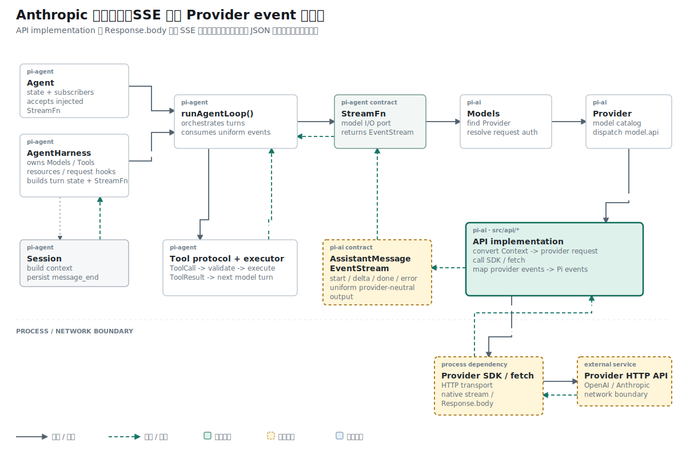

## 名词约定：先区分传输对象与协议对象

本文会连续处理名称相近的对象。先固定它们的含义：

| 名称 | 本文含义 |
| --- | --- |
| HTTP `Response` | `fetch()` 或 SDK 返回的网络响应对象；`body` 是字节流，另外还包含 status 与 headers |
| `ServerSentEvent` | `iterateSseMessages()` 已经恢复完成的一帧 SSE，包含 `event`、`data` 与 `raw` |
| `sse.event` | SSE 传输字段中的事件名字符串，例如 `message_start` |
| `sse.data` | 一帧 SSE 合并后的 data 文本；此时仍是字符串，尚未得到 JavaScript 对象 |
| Anthropic event / Provider event | 对 `sse.data` 执行 JSON 解析后得到的 Anthropic Messages 协议对象 |
| `RawMessageStreamEvent` | Anthropic SDK 提供的 TypeScript 联合类型，列出协议事件可能具有的字段形状 |
| async generator / 异步生成器 | 可以用 `yield` 分批产出值、由调用方通过 `for await` 逐个读取的函数 |
| API implementation / 协议适配器 | `src/api/anthropic-messages.ts` 这一类模块；负责请求转换、网络调用与 Provider event 到 Pi event 的映射 |
| wrapper | 协议适配器中管理一次请求生命周期的外层函数，这里指 `streamSimple()` |

`RawMessageStreamEvent` 只提供编译期约束。`JSON.parse(...) as RawMessageStreamEvent` 会检查 JSON 语法，但不会在运行时逐字段验证对象结构。

## 结论先行

本篇主张：SSE 分帧与 Anthropic 事件解码应保持为两个连续阶段。前者恢复传输边界，后者筛选协议事件、解析 JSON，并检查消息是否从 `message_start` 正常走到 `message_stop`。

推理链如下：

```text
前提 1：iterateSseMessages() 输出的 data 仍是字符串。
前提 2：下游内容块状态机需要按 event.type 分支处理对象。
结论 1：两者之间需要显式的 JSON 解析阶段。

前提 3：SSE 流可以包含 ping、未知事件和 error 帧。
前提 4：这些帧不能全部作为 Anthropic 消息事件交给下游。
结论 2：解析前必须按事件名决定抛错、忽略或接收。

前提 5：message_start 表示一条消息已经开始。
前提 6：缺少 message_stop 的网络结束无法证明消息完整。
结论 3：已经开始的消息必须通过 message_stop 关闭生命周期。
```

这个阶段只产出 Anthropic 原生事件。它尚未把 `content_block_delta` 转成 Pi 的 `text_delta`，也尚未进入当前 `streamSimple()` 网络路径。

## 上一阶段提供了什么输入

上一篇实现的 `iterateSseMessages()` 接收 `ReadableStream<Uint8Array>`，依次恢复 UTF-8 字符、文本行和 SSE 帧。它的输出已经具有稳定帧边界：

```ts
export interface ServerSentEvent {
  event: string | null;
  data: string;
  raw: string[];
}
```

例如，网络文本：

```text
event: message_start
data: {"type":"message_start","message":{"id":"msg_1"}}
<空行>
```

会形成：

```ts
{
  event: "message_start",
  data: '{"type":"message_start","message":{"id":"msg_1"}}',
  raw: [
    "event: message_start",
    'data: {"type":"message_start","message":{"id":"msg_1"}}',
  ],
}
```

这里的 `event` 是传输标签，`data` 是 JSON 文本。下游还不能访问 `event.message.id`，因为 JavaScript 对象尚未建立。

## 问题定义：这一层只完成一种转换

完整返回路径可以拆成四个对象：

```text
Response.body 字节
  -> ServerSentEvent
  -> RawMessageStreamEvent
  -> AssistantMessageEvent
```

本文新增的转换只有中间一步：

```text
ServerSentEvent
  -> iterateAnthropicEvents()
  -> RawMessageStreamEvent
```

`AssistantMessageEvent` 属于 Pi 的统一输出协议，例如 `text_start`、`text_delta` 与 `done`。那一步需要内容块状态机，本次改动没有实现。

## 六种消息事件分别表示什么

代码先建立允许进入消息解析层的事件名集合：

```ts
const ANTHROPIC_MESSAGE_EVENTS: ReadonlySet<string> = new Set([
  "message_start",
  "message_delta",
  "message_stop",
  "content_block_start",
  "content_block_delta",
  "content_block_stop",
]);
```

这里的“message”与“content block”处于两个粒度：

| 事件名 | 协议含义 | 后续状态机的典型用途 |
| --- | --- | --- |
| `message_start` | 整条 assistant 消息开始，携带消息 ID、模型与初始 usage | 初始化最终 AssistantMessage 元数据 |
| `content_block_start` | 一个内容块开始；内容块可能是文本、工具调用或 reasoning | 在 `content[]` 中建立对应块 |
| `content_block_delta` | 某个内容块新增一段数据 | 追加文本或工具参数，并发布 progress event |
| `content_block_stop` | 某个内容块结束 | 发布该块的结束事件并清理临时状态 |
| `message_delta` | 整条消息级别的增量，常包含停止原因与最终 usage | 更新 `stopReason` 与 Token 统计 |
| `message_stop` | 整条消息正常结束 | 关闭 Anthropic 消息生命周期 |

`ReadonlySet<string>` 表示代码只查询集合，不应通过该引用增删名称。集合同时承担白名单作用：不属于这六种名称的 SSE frame 不会进入消息状态机。

## 第一步：确认 Response 确实有 body

异步生成器直接接收标准 HTTP `Response`：

```ts
export async function* iterateAnthropicEvents(
  response: Response,
  signal?: AbortSignal,
): AsyncGenerator<RawMessageStreamEvent> {
  if (!response.body) {
    throw new Error(
      "Attempted to iterate over an Anthropic response with no body",
    );
  }

  // 后续事件循环
}
```

`response.body` 的类型允许 `null`。没有 body 时，字节读取器没有输入，继续执行只会把“缺少响应体”伪装成“没有任何事件”。这里直接抛错，使失败原因停留在真实边界。

## 第二步：逐帧决定抛错、忽略或解析

函数复用前一阶段的读取器：

```ts
for await (const sse of iterateSseMessages(response.body, signal)) {
  if (sse.event === "error") {
    throw new Error(sse.data);
  }

  if (!ANTHROPIC_MESSAGE_EVENTS.has(sse.event ?? "")) {
    continue;
  }

  // 只有白名单事件进入 JSON 解析
}
```

三个结果互斥：

```text
sse.event === "error"       -> 抛出 Provider 错误
事件名属于白名单            -> 解析 data
其他事件名或 null           -> continue，读取下一帧
```

SSE 服务可能发送 `ping` 或注释帧维持连接。它们属于传输活动，不改变 assistant 消息内容。`continue` 保留网络流读取，同时阻止无关帧进入 Provider event 状态机。

`error` 帧采用另一条规则。它表达 Provider 主动报告的失败，函数直接抛出 `sse.data`，不会把失败对象作为普通消息事件 `yield` 给下游。

## 第三步：把 data 文本解析成协议对象

新增 import 把下游事件类型固定为 Anthropic SDK 的联合类型：

```ts
import type {
  MessageCreateParamsStreaming,
  MessageParam,
  RawMessageStreamEvent,
} from "@anthropic-ai/sdk/resources/messages.js";
```

解析发生在白名单筛选之后：

```ts
let event: RawMessageStreamEvent;

try {
  event = JSON.parse(sse.data) as RawMessageStreamEvent;
} catch (error) {
  const message = error instanceof Error
    ? error.message
    : String(error);

  throw new Error(
    `Could not parse Anthropic SSE event ${sse.event}: ` +
      `${message}; data=${sse.data}; raw=${sse.raw.join("\\n")}`,
  );
}
```

错误信息保留三类证据：

| 字段 | 诊断价值 |
| --- | --- |
| `sse.event` | 失败帧声称自己是哪种事件 |
| `sse.data` | 合并后交给 `JSON.parse()` 的精确字符串 |
| `sse.raw` | 网络层恢复出的原始 SSE 行 |

如果只保留 `JSON.parse()` 的 `Unexpected token`，无法判断错误来自事件名、data 合并还是 Provider payload。当前错误文本让三个边界都可检查。

这里仍有一个类型边界：`as RawMessageStreamEvent` 不会验证 `type`、`message`、`usage` 等字段。当前函数保证 JSON 语法成立，并把结果交给 TypeScript 类型系统；运行时 schema 校验尚未实现。

## 第四步：用 start/stop 检查消息生命周期

函数在读取前初始化两个布尔状态：

```ts
let sawMessageStart = false;
let sawMessageStop = false;
```

解析成功后，根据 JSON 对象的 `event.type` 更新状态：

```ts
if (event.type === "message_start") {
  sawMessageStart = true;
} else if (event.type === "message_stop") {
  sawMessageStop = true;
}

yield event;
```

`yield event` 会暂停生成器，把一个 Provider event 交给 `for await` 调用方。调用方请求下一项时，循环才继续读取后续 SSE frame。

网络迭代结束后，函数检查完整性：

```ts
if (sawMessageStart && !sawMessageStop) {
  throw new Error("Anthropic stream ended before message_stop");
}
```

判断只拒绝一种状态：消息已经开始，但没有正常结束。

| `sawMessageStart` | `sawMessageStop` | 当前结果 |
| --- | --- | --- |
| `false` | `false` | 允许结束；可能是空流或只有被忽略的帧 |
| `true` | `true` | 完整消息生命周期 |
| `true` | `false` | 抛出截断错误 |
| `false` | `true` | 当前实现允许；现有测试没有覆盖这种异常顺序 |

最后一行揭示当前校验的范围：它能发现“开始后缺少结束”，尚未验证所有事件顺序，也没有检查 `sse.event` 与 JSON `event.type` 是否一致。

## 当前提交的运行路径停在哪里

在这一提交中，自动测试形成了以下路径：

```text
测试构造 Response
  -> Response.body
  -> iterateSseMessages()
  -> ServerSentEvent
  -> iterateAnthropicEvents()
  -> RawMessageStreamEvent
  -> 测试收集 event.type
```

当前提交中的生产 wrapper 仍走旧路径：

```text
streamSimple()
  -> fetch(POST /v1/messages)
  -> res.json()
  -> outputText()
  -> done
```

因此 `iterateAnthropicEvents()` 在提交时只由测试调用。它已经能够消费真实 `Response.body` 形状，但 `streamSimple()` 尚未把线上响应交给它。

## 参考 Pi 怎样使用这层事件

参考 Pi 的协议适配器先通过 Anthropic SDK 取得 `Response`，再把它交给同名迭代器：

```ts
const response = await client.messages
  .create({ ...params, stream: true }, requestOptions)
  .asResponse();

for await (const event of iterateAnthropicEvents(
  response,
  options?.signal,
)) {
  // message_start / content_block_* / message_delta / message_stop
}
```

随后同一个 Adapter 才建立内容块状态：

```text
content_block_start -> 建立 TextContent / ToolCall / ThinkingContent
content_block_delta -> 追加文本、参数或 reasoning
content_block_stop  -> 发布对应的 *_end
message_delta       -> 更新 stopReason 与 usage
```

当前项目复制到 `RawMessageStreamEvent` 为止。参考 Pi 后半段的内容块映射属于下一项独立机制。

## 测试怎样证明完整 start/stop 流

新增用例名为：

```text
iterateAnthropicEvents parses a complete Anthropic event stream
```

测试先构造一个符合 Anthropic 形状的 `message_start` 对象，其中包含消息 ID、模型和初始 usage：

```ts
const messageStart = {
  type: "message_start",
  message: {
    id: "msg_1",
    type: "message",
    role: "assistant",
    content: [],
    model: "MiniMax-M3",
    stop_reason: null,
    stop_sequence: null,
    usage: {
      input_tokens: 1,
      output_tokens: 0,
    },
  },
};
```

随后把 `message_start` 和 `message_stop` 编码成标准 SSE 文本，交给 `Response`：

```ts
const response = new Response(
  [
    "event: message_start",
    `data: ${JSON.stringify(messageStart)}`,
    "",
    "event: message_stop",
    'data: {"type":"message_stop"}',
    "",
    "",
  ].join("\n"),
);
```

测试通过 `for await` 读取生成器，并断言事件顺序：

```ts
const types: string[] = [];

for await (const event of iterateAnthropicEvents(response)) {
  types.push(event.type);
}

assert.deepEqual(types, ["message_start", "message_stop"]);
```

这项测试同时经过 `Response.body`、字节读取、SSE 分帧、JSON 解析和生命周期结束检查。若 `message_stop` 没有被识别，生成器会在循环结束后抛错，断言无法执行。

## 现有测试没有证明什么

当前只有一条成功路径测试。下列分支已经存在于实现，但没有聚焦回归：

- `response.body` 为 `null`。
- `sse.event === "error"` 时抛出 Provider 错误。
- `ping` 或未知事件名被忽略。
- 白名单事件携带非法 JSON。
- `message_start` 后网络结束，缺少 `message_stop`。
- 六种白名单事件都能按顺序产出。
- `sse.event` 与 JSON `event.type` 不一致。
- AbortSignal 传递给字节读取器后的取消行为。
- 当前 `streamSimple()` 实际调用新迭代器。

成功测试证明“完整的 start/stop 示例可以解析”，不能扩大为“所有错误与事件类型已经验证”。

## 推理复核

| 结论 | 推理方式 | 证据强度 |
| --- | --- | --- |
| 完整 start/stop SSE 可以变成两个 Anthropic event | 构造性证明 | 自动测试覆盖完整输入与输出 |
| 未知 SSE 事件不会进入下游 | 实现分支推导 | 有白名单与 `continue`，缺少专门测试 |
| 开始后缺少 `message_stop` 会失败 | 演绎：终止条件直接规定 | 实现明确，缺少失败测试 |
| `RawMessageStreamEvent` 保证运行时字段合法 | 不成立 | 类型断言没有 runtime schema validation |
| Anthropic wrapper 已经完成流式接线 | 不成立 | 当前提交仍调用 `res.json()` |

主要结论被限定在“传输帧到原生协议事件”。这个范围与当前代码和测试一致。

## 结果与当前阶段

Anthropic 返回路径现在具备第三个稳定边界：字节先恢复为 SSE frame，白名单 frame 再解析为 `RawMessageStreamEvent`，已经开始的消息必须看到 `message_stop` 才能正常结束。

该迭代器尚未进入 `streamSimple()`，也没有把 `content_block_*` 映射成 Pi 内容块与 progress event。下一阶段需要把请求参数、SDK Response、事件迭代器、内容块状态和 `AssistantMessageEventStream` 接成同一条运行路径。

## 复现资料

- 实现：`packages/ai/src/api/anthropic-messages.ts`
- 测试：`packages/ai/test/anthropic-events.test.ts`
- 参考：`~/remake-pi/pi/packages/ai/src/api/anthropic-messages.ts`
- 验证：`npm test -- packages/ai/test/anthropic-events.test.ts`
