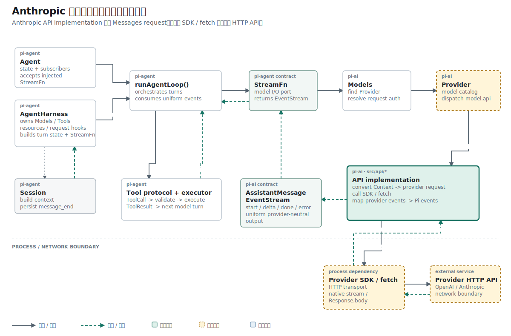

## 结论先行

本篇主张：接入 Anthropic Messages 时，应复用 Provider 无关的 `Context` 与 EventStream，重新实现协议专用的请求转换；`buildParams()` 正确并不能推出网络 wrapper 已经使用它。

推理链如下：

```text
前提 1：OpenAI 与 Anthropic 接收同一段对话语义。
前提 2：两种协议对 system、message、Token 上限和 endpoint 的表达不同。
结论 1：上层 Context 可以共用，请求对象不能共用。

前提 3：纯函数测试只观察 buildParams() 的返回值。
前提 4：当前 streamSimple() 仍手写旧请求体。
结论 2：请求构造能力已经完成，运行路径接线尚未完成。
```

## 已知事实：第二种协议复用上层合同，不复用请求格式

前十个阶段已经把 OpenAI Responses 路径接到 HTTP：

```text
Context
  -> convertResponsesMessages()
  -> POST /responses
  -> SSE events
  -> AssistantMessageEventStream
```

这条路径证明了 Provider、Adapter、EventStream 可以共用同一套上层接口。接入 MiniMax 时，复用范围需要再确认一次。MiniMax 模型声明的配置是：

```ts
{
  id: "MiniMax-M3",
  provider: "minimax",
  api: "anthropic-messages",
  baseUrl: "https://api.minimax.io/anthropic",
}
```

`provider` 表示服务商，`api` 表示线上协议。MiniMax 可以复用 Anthropic Messages Adapter，但不能复用 OpenAI Responses 的请求体和事件名。

进入这一阶段时，可复用与需要重写的部分已经分开：

| 层次 | OpenAI 与 Anthropic 是否共用 | 当前对象 |
| --- | --- | --- |
| Agent 上下文 | 共用 | `Context`、`Message` |
| 最终消息 | 共用 | `AssistantMessage` |
| 进度事件 | 共用 | `AssistantMessageEventStream` |
| Provider 调用合同 | 共用 | `stream()`、`streamSimple()` |
| 请求参数 | 各协议单独实现 | Responses `input[]` / Anthropic `messages[]` |
| HTTP endpoint 与认证 header | 各协议单独实现 | `/responses` / `/v1/messages` |
| 流式事件 | 各协议单独解析 | `response.output_text.delta` / `content_block_delta` |

这一篇处理请求侧，输入仍是 Pi Context，输出改为 Anthropic SDK 定义的 `MessageCreateParamsStreaming`。

## 历史事实：旧请求只保留最后一条 user 消息

项目已经有一个可访问 MiniMax 网络的 wrapper。它从 Context 反向查找最后一条 user 消息：

```ts
function promptFromContext(context: Context): string {
  const lastUser = [...context.messages]
    .reverse()
    .find((message) => message.role === "user");

  return lastUser?.content ?? "";
}
```

`streamSimple()` 把这个字符串写入唯一的 `messages` 元素：

```ts
body: JSON.stringify({
  model: model.id,
  max_tokens: options.maxTokens ?? model.maxTokens,
  messages: [
    {
      role: "user",
      content: promptFromContext(context),
    },
  ],
}),
```

假设 Context 是：

```ts
{
  systemPrompt: "Be concise.",
  messages: [
    { role: "user", content: "Hello", timestamp: 1 },
    {
      role: "assistant",
      content: [{ type: "text", text: "Hi there" }],
      // 其余 AssistantMessage 字段省略
    },
    { role: "user", content: "Summarize our exchange", timestamp: 2 },
  ],
}
```

旧请求只留下最后一句：

```json
{
  "messages": [
    { "role": "user", "content": "Summarize our exchange" }
  ]
}
```

system prompt、第一轮 user 消息和 assistant 回复都没有发送。网络可以返回答案，但服务端看到的对话已经缺失。

## 概念约束：相同语义不等于相同协议对象

两种协议接收相同 Context，字段位置不同：

| Pi 数据 | OpenAI Responses | Anthropic Messages |
| --- | --- | --- |
| system prompt | `input[]` 中的 `role: "system"` | 顶层 `system` |
| user 文本 | `input_text` content block | `role: "user"` message |
| assistant 文本 | `output_text` content block | `role: "assistant"` content block |
| 输出上限 | 由 Responses 参数表达 | `max_tokens` |
| 流式开关 | `stream: true` | `stream: true` |
| endpoint | `POST /responses` | `POST /v1/messages` |
| API Key header | `Authorization: Bearer ...` | `x-api-key: ...` |

因此 `convertResponsesMessages()` 不能直接交给 Anthropic 请求。共用的是 Context，不是 Provider 请求对象。

## 问题定义：请求构造需要两个连续变换

请求构造被拆成两个连续步骤：

```text
Context.messages
  -> convertMessages()
  -> MessageParam[]
  -> buildParams()
  -> MessageCreateParamsStreaming
```

`convertMessages()` 只负责消息历史。`buildParams()` 再加入模型、system prompt、Token 上限和流式开关。两个函数都不读取环境变量，也不执行 `fetch()`，测试不需要 API Key。

## 机制一：用 SDK 类型固定协议边界

改动引入的是 Anthropic SDK 类型：

```ts
import type {
  MessageCreateParamsStreaming,
  MessageParam,
} from "@anthropic-ai/sdk/resources/messages.js";
```

`import type` 在运行时不会创建 SDK client。当前网络仍由原生 `fetch()` 发出。SDK 在这里承担请求结构校验：字段名、角色和 content block 形状由公开协议类型约束。

如果函数只返回普通对象，`maxTokens` 或 `systemPrompt` 这类项目内部命名可能误入 HTTP body。返回类型写成 `MessageCreateParamsStreaming` 后，请求侧使用 Anthropic 字段 `max_tokens` 和 `system`。

## 机制二：按顺序转换完整消息历史

`convertMessages()` 按原顺序遍历 Context：

```ts
export function convertMessages(messages: Message[]): MessageParam[] {
  const params: MessageParam[] = [];

  for (const message of messages) {
    if (message.role === "user") {
      params.push({
        role: "user",
        content: message.content,
      });
      continue;
    }

    const content: { type: "text"; text: string }[] = [];

    for (const block of message.content) {
      if (block.type === "text") {
        content.push({
          type: "text",
          text: block.text,
        });
      }
    }

    if (content.length > 0) {
      params.push({
        role: "assistant",
        content,
      });
    }
  }

  return params;
}
```

当前 `UserMessage.content` 只有字符串，可以直接写入 Anthropic user message。`AssistantMessage.content` 是内容块数组，转换函数目前只保留 `type: "text"` 的块。

这段实现已经恢复多轮文本历史，同时保留了明确边界：

- user 字符串进入 user message。
- assistant 文本进入 Anthropic text block。
- 没有文本块的 assistant 消息会被跳过。
- `toolCall` 还没有转换成 `tool_use`。
- 当前 Context 还没有 `ToolResultMessage` 与图片输入类型。

参考 Pi 的同名函数还会处理图片、thinking、tool use、tool result、缓存标记、跨 Provider 消息修复和非法 Unicode。当前版本只复制了这一阶段类型系统能够表达的文本子集。

## 机制三：组合顶层请求参数

`buildParams()` 把协议字段集中到一个对象：

```ts
export function buildParams(
  model: Model<"anthropic-messages">,
  context: Context,
  options?: AnthropicMessagesOptions,
): MessageCreateParamsStreaming {
  const params: MessageCreateParamsStreaming = {
    model: model.id,
    messages: convertMessages(context.messages),
    max_tokens: options?.maxTokens ?? model.maxTokens,
    stream: true,
  };

  if (context.systemPrompt) {
    params.system = [
      {
        type: "text",
        text: context.systemPrompt,
      },
    ];
  }

  return params;
}
```

`systemPrompt` 没有混进 `messages`。Anthropic Messages 把 system 内容放在顶层，当前代码用 text block 数组表示它。

## 演绎：`max_tokens` 的取值顺序必须唯一

一次调用可以临时覆盖模型目录中的输出上限：

```ts
max_tokens: options?.maxTokens ?? model.maxTokens
```

取值顺序只有两层：

```text
本次调用 options.maxTokens
  -> 未提供时使用 model.maxTokens
```

MiniMax-M3 的模型目录值是 `128000`。测试传入 `{ maxTokens: 64 }` 后，请求必须使用 `64`。这里使用 `??`，所以只有 `null` 或 `undefined` 才会回退；`0` 不会被静默替换。服务端是否接受 `0` 属于 API 校验，不由该表达式决定。

## 目标因果链：构造结果应怎样进入网络

完成接线后的请求路径应为：

```text
Context + Model + options
  -> buildParams()
  -> JSON.stringify(params)
  -> POST {baseUrl}/v1/messages
  -> Response.body
```

使用当前 `fetch()` 风格，对应代码会是：

```ts
const params = buildParams(model, context, options);

const res = await fetch(
  `${model.baseUrl.replace(/\/+$/, "")}/v1/messages`,
  {
    method: "POST",
    headers: {
      "x-api-key": options.apiKey,
      "anthropic-version": "2023-06-01",
      "content-type": "application/json",
    },
    body: JSON.stringify(params),
  },
);
```

参考 Pi 使用 Anthropic SDK 发出同一层请求：

```ts
let params = buildParams(model, context, isOAuth, options);

const response = await client.messages
  .create({ ...params, stream: true }, requestOptions)
  .asResponse();
```

SDK 版本还管理 client、超时、重试、自定义 headers 和 AbortSignal。两种写法的架构位置相同：`buildParams()` 产出 Provider 请求，网络 client 负责传输。

## 当前事实：运行路径仍然绕过新函数

当前仓库尚未执行上面的接线。`streamSimple()` 仍手写旧 body：

```ts
body: JSON.stringify({
  model: model.id,
  max_tokens: options.maxTokens ?? model.maxTokens,
  messages: [
    {
      role: "user",
      content: promptFromContext(context),
    },
  ],
}),
```

响应侧也仍然等待最终 JSON：

```ts
const data = (await res.json()) as AnthropicMessagesResponse;
const message = createMessage(model, outputText(data), data);
```

因此仓库里同时存在两条路径：

```text
已验证的纯函数：Context -> buildParams() -> 完整流式请求对象
当前运行路径：  Context -> promptFromContext() -> 单条 user 请求 -> res.json()
```

`buildParams()` 中的 `stream: true` 目前不会到达网络。文章记录的是请求构造能力完成，运行闭环仍停留在旧实现。

## 证据边界：测试证明对象，不证明接线

两个默认用例分别命名为 `converts Pi messages into Anthropic messages` 和 `builds MiniMax Anthropic request parameters`。前者关闭消息数组转换，后者关闭完整请求对象。

第一项测试固定消息转换：

```ts
const messages: Message[] = [
  { role: "user", content: "Hello", timestamp: 1 },
  assistant,
];

assert.deepEqual(convertMessages(messages), [
  { role: "user", content: "Hello" },
  {
    role: "assistant",
    content: [{ type: "text", text: "Hi there" }],
  },
]);
```

第二项测试从 MiniMax Provider 取得真实模型配置，再检查完整参数：

```ts
const model = minimaxProvider().getModels()[0];
assert.ok(model);

const context: Context = {
  systemPrompt: "Be concise.",
  messages: [
    { role: "user", content: "Hello", timestamp: 1 },
    assistant,
  ],
};

assert.deepEqual(buildParams(model, context, { maxTokens: 64 }), {
  model: "MiniMax-M3",
  messages: [
    { role: "user", content: "Hello" },
    {
      role: "assistant",
      content: [{ type: "text", text: "Hi there" }],
    },
  ],
  max_tokens: 64,
  stream: true,
  system: [{ type: "text", text: "Be concise." }],
});
```

这两项测试证明：消息顺序得到保留，system prompt 位于顶层，调用级 Token 上限覆盖模型默认值，流式开关已经进入请求对象。

测试没有 mock `fetch()`，所以无法证明 `streamSimple()` 使用该对象。这个缺口可以通过 wrapper 测试捕获请求 body 后关闭。

## 推理复核

| 结论 | 推理方式 | 当前证据 |
| --- | --- | --- |
| user、assistant 与 system 文本能形成 Anthropic 请求 | 构造与等值比较 | 两项纯函数测试覆盖 |
| 调用级 `maxTokens` 优先于模型默认值 | 演绎：`??` 的固定次序 | 测试传入 64 并断言 `max_tokens` |
| MiniMax 可以复用 OpenAI Responses 请求体 | 不成立 | 模型声明 `api: "anthropic-messages"`，字段结构不同 |
| `stream: true` 已经发送到网络 | 不成立 | 当前 wrapper 仍手写旧 body |

本文把“协议对象成立”和“运行时使用该对象”保持为两个不同命题。

## 结果与当前阶段

Anthropic Adapter 已经拥有独立、带类型的请求构造层。它覆盖当前项目能表达的 user/assistant 文本历史，并把 system、模型和调用选项组合成 `MessageCreateParamsStreaming`。

运行路径仍发送单条 user 消息并调用 `res.json()`。下一阶段从响应协议入手：当请求启用 `stream: true` 后，HTTP body 不再是一个最终 JSON 对象，需要先按照 SSE 的空行边界恢复传输帧。

## 复现资料

- 实现：`packages/ai/src/api/anthropic-messages.ts`
- 测试：`packages/ai/test/anthropic-messages-conversion.test.ts`
- 模型：`packages/ai/src/providers/minimax.models.ts`
- 参考：`~/remake-pi/pi/packages/ai/src/api/anthropic-messages.ts`
- 验证：`npm test -- packages/ai/test/anthropic-messages-conversion.test.ts`
