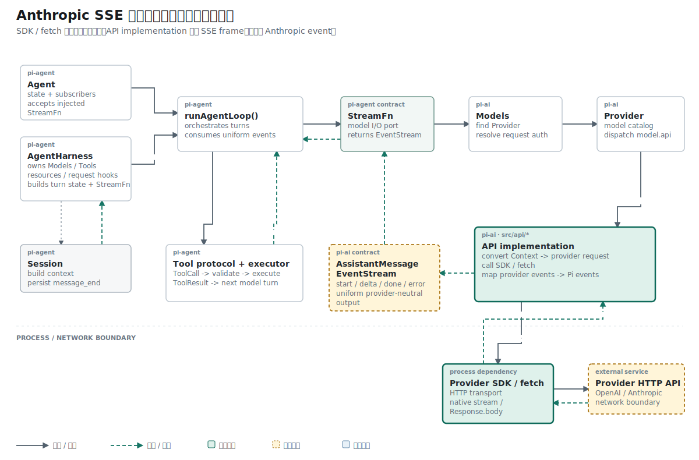

## 名词约定：行、帧与事件属于三个层次

| 名称 | 本文含义 |
| --- | --- |
| SSE line | 以换行符结束的一行传输文本，例如 `event: message_start` |
| SSE frame | 由空行结束的一组 SSE line；代码中表示为 `ServerSentEvent` |
| `sse.event` | SSE frame 的事件名字段，仍是普通字符串 |
| Provider event | 对 `sse.data` 执行 JSON 解析后得到的 Anthropic 协议对象 |
| Pi event | Adapter 再次转换后交给 Agent Runtime 的统一事件 |

本文只处理 line 到 frame。JSON 解析和 Pi 事件映射分别属于后续两个阶段。

## 结论先行

本篇主张：Anthropic 流式响应必须先恢复 SSE 帧，再解析 JSON 和 Provider event；形成中的可变状态与已经返回的事件快照必须使用不同类型。

推理链如下：

```text
前提 1：SSE 允许一个事件包含多条 data 行。
前提 2：单条文本行不能保证包含完整 JSON。
结论 1：JSON 解析只能发生在空行提交完整帧之后。

前提 3：解码器要复用同一个 state 处理连续事件。
前提 4：已经交给下游的事件不能随 state 后续变化。
结论 2：提交时必须创建独立 ServerSentEvent 快照并重置 state。
```

## 已知事实：`stream: true` 改变了响应合同

上一阶段完成了 Anthropic 请求参数：

```ts
{
  model: "MiniMax-M3",
  messages: [...],
  max_tokens: 64,
  stream: true,
}
```

旧 `streamSimple()` 仍发送非流式请求，并把响应当作一个 JSON 对象：

```ts
const data = (await res.json()) as AnthropicMessagesResponse;
const message = createMessage(model, outputText(data), data);
```

非流式响应结束后才能得到完整对象：

```json
{
  "id": "msg_1",
  "content": [{ "type": "text", "text": "Hi" }],
  "usage": { "input_tokens": 4, "output_tokens": 1 }
}
```

启用 `stream: true` 后，响应的 `Content-Type` 变为 `text/event-stream`。HTTP body 是持续到达的 SSE 文本：

```text
event: message_start
data: {"type":"message_start","message":{"id":"msg_1"}}

event: content_block_delta
data: {"type":"content_block_delta","index":0,"delta":{"type":"text_delta","text":"Hi"}}

event: message_stop
data: {"type":"message_stop"}

```

此时 `res.json()` 无法描述响应生命周期。解析需要逐层恢复边界。

## 概念约束：传输行、SSE 帧、Provider 事件与 Pi 事件

Anthropic 流式响应经过三种表示：

```text
SSE 文本行
  -> ServerSentEvent
  -> RawMessageStreamEvent
  -> AssistantMessageEvent
```

它们分别属于不同协议：

| 表示 | 示例 | 负责的协议 |
| --- | --- | --- |
| SSE 行 | `data: {...}` | HTTP 传输格式 |
| SSE 帧 | `{ event, data, raw }` | 一次完整 SSE message |
| Anthropic 事件 | `{ type: "content_block_delta", ... }` | Provider 流协议 |
| Pi 事件 | `{ type: "text_delta", ... }` | Agent Runtime |

如果收到一条 `data:` 行就立刻 `JSON.parse()`，解析器会依赖“每个 JSON 只占一行”的偶然条件。SSE 允许一个事件包含多条 `data:`，完整 data 需要在帧结束后才能确定。

这一阶段只关闭前两层：完整文本行进入，稳定的 `ServerSentEvent` 输出。

## 协议前提：SSE 用空行提交一帧

一帧常见结构如下：

```text
event: message_start
data: {"type":"message_start"}
<空行>
```

前三行对应三个动作：

```text
event 行  -> 记录事件名
data 行   -> 追加数据文本
空行      -> 提交当前帧
```

空行属于协议边界，不属于业务数据。只有空行到达后，当前 `event` 和全部 `data` 才能作为一个整体交给下游。

## 问题定义：可变 state 与稳定事件如何分离

解码过程中需要保存尚未结束的帧。帧提交后，解码器还要继续复用状态读取下一帧。代码为两个生命周期定义了两个类型：

```ts
export interface SseDecoderState {
  event: string | null;
  data: string[];
  raw: string[];
}

export interface ServerSentEvent {
  event: string | null;
  data: string;
  raw: string[];
}
```

字段相近，生命周期不同：

```text
SseDecoderState
  可变
  保存形成中的帧
  data 是逐行累积的 string[]

ServerSentEvent
  返回给下游的快照
  表示已经完成的帧
  data 是合并后的 string
```

如果直接返回 state 中的数组，再执行 `state.data = []` 或继续追加，调用方拿到的历史帧可能随解码过程变化。提交时需要复制数据。

## 机制概览：逐行状态机只恢复帧

改动前，Anthropic wrapper 只有最终响应对象 `AnthropicMessagesResponse`。它描述 `id`、`content` 和 `usage`，没有传输帧概念。

这一阶段新增了独立的小状态机：

```text
decodeSseLine(line, state)
  -> null                 帧仍在形成
  -> ServerSentEvent      空行结束一帧
```

函数没有网络读取，也没有 Anthropic SDK event。测试可以按顺序输入字符串，直接观察状态变化。

## 机制一：按第一个冒号拆分字段

`decodeSseLine()` 先处理边界和注释：

```ts
if (line === "") {
  return flushSseEvent(state);
}

state.raw.push(line);

if (line.startsWith(":")) {
  return null;
}
```

以冒号开头的行是 SSE 注释，常被服务端用作 keep-alive：

```text
: ping
```

当前实现把注释保存在 `raw` 里，但不加入 `event` 或 `data`。这样解析错误时仍能看到服务端发送过的原始行。

普通字段只按第一个冒号切分：

```ts
const delimiterIndex = line.indexOf(":");

const fieldName =
  delimiterIndex === -1
    ? line
    : line.slice(0, delimiterIndex);

let value =
  delimiterIndex === -1
    ? ""
    : line.slice(delimiterIndex + 1);

if (value.startsWith(" ")) {
  value = value.slice(1);
}
```

以这行数据为例：

```text
data: {"type":"message_start","message":{"id":"msg_1"}}
```

第一个冒号分隔字段名 `data` 和字段值。JSON 内部后续出现的冒号全部保留。SSE 允许分隔冒号后有一个可选空格，代码只移除这一个空格。

没有冒号的行会被视为只有字段名、值为空字符串。当前实现只消费 `event` 与 `data`，其他字段会保留在 `raw` 后被忽略：

```ts
if (fieldName === "event") {
  state.event = value;
} else if (fieldName === "data") {
  state.data.push(value);
}
```

SSE 标准还定义 `id` 和 `retry`。Anthropic 消息解析当前不需要它们，因此没有加入输出对象。

## 机制二：多行 data 必须先累积

一帧可以包含多条 `data:`：

```text
event: content_block_delta
data: {"type":"content_block_delta","index":0,
data: "delta":{"type":"text_delta","text":"Hi"}}

```

两行依次进入 `state.data`：

```ts
[
  '{"type":"content_block_delta","index":0,',
  '"delta":{"type":"text_delta","text":"Hi"}}',
]
```

提交时按照 SSE 规则用换行连接：

```ts
data: state.data.join("\n")
```

下游最终收到：

```json
{"type":"content_block_delta","index":0,
"delta":{"type":"text_delta","text":"Hi"}}
```

换行属于合并结果。JSON parser 是否接受它，由 JSON 语法和 data 内容共同决定。SSE 分帧器不修改 Provider payload。

## 机制三：提交快照并重置状态

`flushSseEvent()` 在空行到达时执行：

```ts
function flushSseEvent(
  state: SseDecoderState,
): ServerSentEvent | null {
  if (!state.event && state.data.length === 0) {
    return null;
  }

  const event: ServerSentEvent = {
    event: state.event,
    data: state.data.join("\n"),
    raw: [...state.raw],
  };

  state.event = null;
  state.data = [];
  state.raw = [];

  return event;
}
```

处理顺序可以展开成：

```text
1. 检查当前 state 是否包含 event 或 data
2. 合并 data 行
3. 复制 raw 数组
4. 清空 state
5. 返回完成帧
```

`raw: [...state.raw]` 创建独立数组。返回值不会受到下一帧写入影响。只有注释、没有 `event/data` 的 state 在空行时返回 `null`，随后当前实现不会清空 `raw`；现有测试没有覆盖这个边界。

## 拓扑位置：完整帧怎样进入 Anthropic 事件层

参考 Pi 的响应链是：

```text
Response.body
  -> iterateSseMessages()
  -> ServerSentEvent
  -> iterateAnthropicEvents()
  -> RawMessageStreamEvent
  -> AssistantMessageEventStream
```

`iterateAnthropicEvents()` 只接收完成帧。参考实现先处理错误事件和事件名白名单，再解析 JSON：

```ts
for await (const sse of iterateSseMessages(
  response.body,
  signal,
)) {
  if (sse.event === "error") {
    throw new Error(sse.data);
  }

  if (!ANTHROPIC_MESSAGE_EVENTS.has(sse.event ?? "")) {
    continue;
  }

  const event = parseJsonWithRepair<RawMessageStreamEvent>(
    sse.data,
  );

  yield event;
}
```

这一层还会检查已经看到 `message_start` 的流是否正常到达 `message_stop`。传输帧解析与 Provider 生命周期检查保持独立，错误信息可以同时包含 `sse.event`、`sse.data` 和 `sse.raw`。

当前仓库只实现了 `ServerSentEvent`。`iterateAnthropicEvents()` 尚未复制，所以 `content_block_delta` 还不会变成 Pi 的 `text_delta`。

## 证据一：单帧测试关闭提交与复位

默认用例 `decodeSseLine builds one Anthropic SSE frame` 逐行验证单帧提交；`decodeSseLine assembles consecutive Anthropic response events` 验证复位后的 state 可以继续处理下一帧。

第一项测试逐行输入：

```ts
const state: SseDecoderState = {
  event: null,
  data: [],
  raw: [],
};

assert.equal(
  decodeSseLine("event: message_start", state),
  null,
);

assert.equal(
  decodeSseLine('data: {"type":"message_start"}', state),
  null,
);
```

前两行只修改 state。空行提交完整帧：

```ts
assert.deepEqual(decodeSseLine("", state), {
  event: "message_start",
  data: '{"type":"message_start"}',
  raw: [
    "event: message_start",
    'data: {"type":"message_start"}',
  ],
});
```

同一个测试继续检查 state 已复位：

```ts
assert.deepEqual(state, {
  event: null,
  data: [],
  raw: [],
});
```

这项断言同时覆盖“完成帧可返回”和“下一帧从空状态开始”。

## 证据二：连续事件测试排除串帧

第二项测试依次输入 `message_start` 与 `content_block_delta`：

```ts
const lines = [
  "event: message_start",
  'data: {"type":"message_start","message":{"id":"msg_1"}}',
  "",
  "event: content_block_delta",
  'data: {"type":"content_block_delta","index":0,"delta":{"type":"text_delta","text":"Hi"}}',
  "",
];
```

最终得到两个独立事件名：

```ts
assert.deepEqual(
  frames.map((frame) => frame.event),
  ["message_start", "content_block_delta"],
);
```

测试随后解析每帧的 `data`，确认边界恢复后 JSON 仍完整：

```ts
assert.deepEqual(
  frames.map((frame) => JSON.parse(frame.data).type),
  ["message_start", "content_block_delta"],
);
```

现有测试覆盖单帧、状态重置与连续帧。注释、多行 `data`、未知字段和空 data 尚未形成回归用例，文章中的行为来自当前实现与 SSE 规则对照。

## 缺失前提：网络提供字节，不提供完整行

`decodeSseLine()` 的参数是完整字符串行：

```ts
decodeSseLine(line: string, state: SseDecoderState)
```

真实 `Response.body` 提供的是 `Uint8Array` chunk。网络可能把 `event: message_start` 从任意位置拆开，也可能把一个 UTF-8 字符的字节分到两个 chunk。

当前测试手工准备完整行，所以它没有证明网络输入能够满足该函数的前提。下一阶段增加 `iterateSseMessages()`，先从任意字节 chunk 恢复文本行，再复用本文的帧状态机。

## 推理复核

| 结论 | 推理方式 | 当前证据 |
| --- | --- | --- |
| 空行可以提交一帧并复位 state | 状态机测试 | 单帧用例同时断言返回值与空 state |
| 连续帧不会共享 data | 反例排除 | 两帧测试分别解析 JSON type |
| 每条 `data:` 都可以立即 `JSON.parse()` | 不成立 | SSE 允许多行 data |
| 当前代码已经读取真实 HTTP 字节流 | 不成立 | `decodeSseLine()` 的输入仍是完整 string 行 |

这里的核心同一律是生命周期同一：`SseDecoderState` 表示形成中的帧，`ServerSentEvent` 表示已经完成的帧，两者不能互换。

## 结果与当前阶段

Anthropic 响应侧已经有清晰的 SSE 帧边界：`event`、多行 `data` 和原始文本先进入可变 state，空行将其提交为独立快照。JSON 解析被留在完整帧之后。

当前 `streamSimple()` 仍调用 `res.json()`；网络字节读取与 Anthropic event 映射都未接入运行路径。下一篇处理 `ReadableStream<Uint8Array>` 中的 chunk、UTF-8 解码和换行恢复。

## 复现资料

- 实现：`packages/ai/src/api/anthropic-messages.ts`
- 测试：`packages/ai/test/anthropic-sse-decoder.test.ts`
- 参考：`~/remake-pi/pi/packages/ai/src/api/anthropic-messages.ts`
- 验证：`npm test -- packages/ai/test/anthropic-sse-decoder.test.ts`
