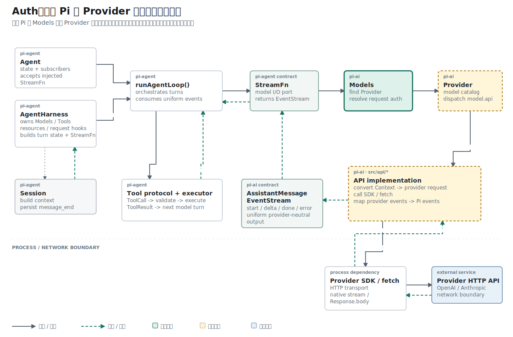

## 名词约定：认证策略位于请求之前

| 名称 | 本文含义 |
| --- | --- |
| credential | 可保存的凭证记录，例如登录后保存的 API Key |
| 认证策略 | 从 credential、环境变量等来源中选出本次请求认证数据的规则 |
| `ModelAuth` | 解析完成后的请求级结果，包含 `apiKey`、headers 或动态 Base URL |
| API implementation / Adapter | 按具体协议构造 HTTP 请求的本地模块；它消费 `ModelAuth`，但不决定凭证来源 |
| `Models` | 参考 Pi 中连接 Provider 认证策略与 API implementation 的上层集合对象 |

本文中的 Adapter 指协议适配器，Provider 仍是独立的服务商级对象；`Models` 专指参考 Pi 的运行时集合对象，不作模型数组的泛称。

## 结论先行

本篇主张：API Key 的来源解析应先于网络请求，并且解析结果应收敛为一次请求可直接使用的 `ModelAuth`。

推理链如下：

```text
前提 1：已存凭证、环境变量和测试注入都可能提供 API Key。
前提 2：HTTP Adapter 只需要本次请求使用的 Key，不应理解凭证存储方式。
结论 1：凭证来源与 HTTP header 之间需要独立的认证解析层。

前提 3：同一次请求只能选定一组生效认证。
前提 4：多个来源若没有固定优先级，结果会随调用入口变化。
结论 2：认证策略必须定义唯一、可测试的解析顺序。
```

本文先界定凭证、解析规则和请求认证三个概念，再用实现与测试证明它们如何衔接。

## 已知事实：第一篇只关闭了手工认证路径

第一篇用一次 `fetch()` 跑通了 OpenAI 网络请求：

```text
.env
  -> 调用脚本读取 OPENAI_API_KEY
  -> OpenAIConfig.apiKey
  -> callOpenAI()
  -> Authorization header
  -> OpenAI HTTP API
```

`callOpenAI()` 收到的已经是一段可发送的 Key。它不读取 `.env`，凭证来源由调用脚本决定。

接入更多 Provider 后，每个调用入口都可能重复处理这些来源：

```text
登录后保存的 Key
环境变量 OPENAI_API_KEY
环境变量 MINIMAX_API_KEY
测试提供的假值
```

这一阶段增加一段统一转换：

```text
凭证来源
  -> Provider 认证策略
  -> 本次请求可用的 ModelAuth
  -> API Adapter
  -> HTTP header
```

改动没有重写 HTTP 请求。它先回答一个更窄的问题：请求发出前，怎样选出要用的 Key。

## 事实一：旧路径把认证责任交给调用脚本

最初的手工脚本直接读取 `process.env`：

```ts
const result = await callOpenAI(
  {
    apiKey: process.env.OPENAI_API_KEY!,
    baseUrl: process.env.OPENAI_BASE_URL!,
    model: "gpt-5.4-mini",
  },
  "Say hi",
);
```

网络函数只负责把参数写入 Bearer Token：

```ts
const res = await fetch(url, {
  method: "POST",
  headers: {
    authorization: `Bearer ${config.apiKey}`,
    "content-type": "application/json",
  },
  body: JSON.stringify({
    model: config.model,
    input: prompt,
  }),
});
```

这条路径没有统一规则来回答：已存 Key 和环境变量同时存在时选哪个、多个环境变量按什么顺序查找、没有凭证时返回什么。

## 事实二：解析的输出是请求认证

`envApiKeyAuth()` 创建一项 API Key 认证策略：

```ts
const auth = envApiKeyAuth(
  "OpenAI API key",
  ["OPENAI_API_KEY"],
);
```

调用 `resolve()` 时传入已存凭证和环境读取接口：

```ts
const result = await auth.resolve({
  model,
  credential: {
    type: "api_key",
    key: "stored-key",
  },
  ctx: {
    env: async (name) =>
      name === "OPENAI_API_KEY"
        ? "env-key"
        : undefined,
  },
});
```

返回结果是：

```ts
{
  auth: {
    apiKey: "stored-key",
  },
  source: "stored credential",
}
```

数据变化可以压缩成一行：

```text
ApiKeyCredential 或环境变量
  -> resolve()
  -> AuthResult.auth
  -> ModelAuth.apiKey
```

`source` 用于状态展示和诊断。HTTP 请求只消费 `auth.apiKey`。

## 概念约束：五个对象不能互换

认证类型较多，可以按输入、规则和输出理解：

| 对象 | 位置 | 职责 |
| --- | --- | --- |
| `ApiKeyCredential` | 输入 | 保存登录得到的 Key |
| `AuthContext` | 输入 | 提供环境变量读取接口 |
| `ApiKeyAuth` | 规则 | 定义 `login()` 和 `resolve()` |
| `AuthResult` | 输出 | 包装认证数据与来源说明 |
| `ModelAuth` | 输出内部 | 提供请求可直接使用的 `apiKey`、`headers`、`baseUrl` |

两个最容易混淆的类型是 `ApiKeyCredential` 和 `ModelAuth`：

```ts
export interface ApiKeyCredential {
  type: "api_key";
  key?: string;
  env?: ProviderEnv;
}

export interface ModelAuth {
  apiKey?: string;
  headers?: ProviderHeaders;
  baseUrl?: string;
}
```

`ApiKeyCredential` 面向保存，因此带有凭证类型；`ModelAuth` 面向单次请求，因此直接使用请求字段。两者名称接近，但定义和生命周期不同。

`AuthContext` 把环境读取变成注入接口：

```ts
export interface AuthContext {
  env(name: string): Promise<string | undefined>;
}
```

认证模块通过 `ctx.env()` 取值，不绑定 `process.env`。Node 入口可以读取真实环境变量，测试可以返回固定字符串。

Provider 最外层使用 `ProviderAuth` 挂载策略：

```ts
export interface ProviderAuth {
  apiKey?: ApiKeyAuth;
}
```

当前只有 API Key 分支；这个外壳为其他认证方式保留 Provider 级入口。

## 演绎：来源优先级必须唯一

`resolve()` 的实现是：

```ts
resolve: async ({ ctx, credential }) => {
  if (credential?.key) {
    return {
      auth: { apiKey: credential.key },
      source: "stored credential",
    };
  }

  for (const envVar of envVars) {
    const value = await ctx.env(envVar);

    if (value) {
      return {
        auth: { apiKey: value },
        source: envVar,
      };
    }
  }

  return undefined;
}
```

实现把优先级收敛为三个互斥结果：

```text
1. credential.key
2. envVars 中第一个有值的环境变量
3. undefined
```

已存 Key 优先，环境变量不会覆盖用户已经保存的选择。`undefined` 表示当前 Provider 没有配置可用认证。

helper 还提供 `login()`：它通过回调请求用户输入，再返回 `{ type: "api_key", key }`。当前仓库还没有 credential store，所以这项返回值尚未进入持久化流程。

登录交互本身也有明确类型：

```ts
export type AuthPrompt = {
  type: "secret";
  message: string;
};

export interface AuthLoginCallbacks {
  prompt(prompt: AuthPrompt): Promise<string>;
}
```

helper 内部调用 `callbacks.prompt(...)`，CLI 或 UI 决定怎样展示输入框。认证策略只接收返回的字符串。

## 当前事实：Provider 已声明策略，运行时尚未调用

OpenAI Provider 把认证规则和模型、Adapter 一起注册：

```ts
export function openaiProvider() {
  return createProvider({
    id: "openai",
    auth: {
      apiKey: envApiKeyAuth(
        "OpenAI API key",
        ["OPENAI_API_KEY"],
      ),
    },
    models: Object.values(OPENAI_MODELS),
    api: openAIResponsesApi(),
  });
}
```

MiniMax 使用同一个 helper，只把变量名换成 `MINIMAX_API_KEY`。Adapter 因此不需要包含环境变量名称。

当前 `createProvider()` 仍直接委托调用：

```ts
streamSimple: (model, context, options) =>
  input.api.streamSimple(model, context, options)
```

这里没有执行 `provider.auth.apiKey.resolve()`。若现在手工连接，调用形状会是：

```ts
const resolved = await provider.auth.apiKey?.resolve({
  model,
  credential,
  ctx: authContext,
});

const stream = provider.streamSimple(
  model,
  context,
  { apiKey: resolved?.auth.apiKey },
);
```

这段代码用于展示两个接口怎样衔接。当前仓库没有统一入口执行它，手工网络脚本仍可直接把环境变量传给 Adapter。

## 因果链：ModelAuth 怎样变成 HTTP header

OpenAI Adapter 把 `options.apiKey` 写入 Bearer Token：

```ts
if (!options?.apiKey) {
  throw new Error("No API key for provider");
}

const res = await fetch(url, {
  method: "POST",
  headers: {
    authorization: `Bearer ${options.apiKey}`,
    "content-type": "application/json",
  },
  body: JSON.stringify(payload),
});
```

Anthropic Messages Adapter 消费同一个字段，但使用 `x-api-key`：

```ts
headers: {
  "x-api-key": options.apiKey,
  "anthropic-version": "2023-06-01",
  "content-type": "application/json",
}
```

由此可以得到职责划分：认证层决定使用哪个 Key，API implementation 决定该协议把 Key 放进哪个 HTTP header。

## 缺失前提：参考 Pi 用 Models 完成接线

参考 Pi 的完整路径是：

```text
Models.streamSimple()
  -> 找到 model.provider 对应的 Provider
  -> applyAuth()
  -> resolveProviderAuth()
  -> 合并请求 options 与 AuthResult
  -> provider.streamSimple()
  -> API implementation
  -> SDK / HTTP
```

`applyAuth()` 解析认证后，用结果生成本次请求的 model 和 options：

```ts
const resolution = await resolveProviderAuth(
  this.requireProvider(model),
  model,
  this.credentials,
  this.authContext,
  {
    apiKey: options?.apiKey,
    env: options?.env,
  },
);

const auth = resolution?.auth;
if (!auth) {
  return { requestModel: model, requestOptions: options };
}

const requestModel = auth.baseUrl
  ? { ...model, baseUrl: auth.baseUrl }
  : model;

const apiKey = options?.apiKey ?? auth.apiKey;
```

参考实现还会合并 headers 和 Provider 环境配置。当前项目尚未实现 `Models` 集合、credential store 和 `applyAuth()`，所以拓扑图展示的是认证在完整 Pi 路径中的位置。

## 证据边界：三个测试关闭三条分支

最初的 `test_auth.ts` 只是把 `process.env` 包装成 `AuthContext`，调用 `envApiKeyAuth()` 后打印结果。它仍然依赖本机环境，不能作为稳定回归。

后续 `auth.test.ts` 把三条规则改成默认测试：

```text
envApiKeyAuth resolves an env key
stored credential wins over env key
missing credential and env returns undefined
```

环境变量用例证明 `AuthContext` 可以提供 Key：

```ts
const result = await auth.resolve({
  model,
  ctx: {
    env: async (name) =>
      name === "OPENAI_API_KEY"
        ? "env-key"
        : undefined,
  },
});

assert.equal(result?.auth.apiKey, "env-key");
assert.equal(result?.source, "OPENAI_API_KEY");
```

优先级用例同时提供两个来源：

```ts
const result = await auth.resolve({
  model,
  credential: { type: "api_key", key: "stored-key" },
  ctx: { env: async () => "env-key" },
});

assert.equal(result?.auth.apiKey, "stored-key");
assert.equal(result?.source, "stored credential");
```

未配置用例让环境读取返回空值：

```ts
const result = await auth.resolve({
  model,
  ctx: { env: async () => undefined },
});

assert.equal(result, undefined);
```

三项测试覆盖 Key 的来源选择。它们没有证明 Provider 会在网络请求前自动调用策略，也没有覆盖 `login()`、多个环境变量、headers 或动态 Base URL。

## 推理复核

| 结论 | 推理方式 | 当前证据 |
| --- | --- | --- |
| 已存 Key 优先于环境变量 | 演绎：实现分支规定顺序 | 优先级测试直接覆盖 |
| Adapter 无需读取 `process.env` | 职责推导 | `AuthContext` 注入环境读取，Adapter 只接收 `ModelAuth` |
| Provider 会自动解析认证 | 不成立 | `createProvider()` 仍直接委托 Adapter |
| 网络请求能够消费解析结果 | 接口兼容性推导 | 两类 Adapter 都读取 `options.apiKey`，统一接线尚缺 |

最后两行区分“接口已经对齐”和“运行路径已经连通”。前者不能推出后者。

## 结果与当前阶段

API Key 已经有了独立的请求前解析过程：Provider 声明 `ApiKeyAuth`，`resolve()` 从已存 credential 或 `AuthContext` 取得 Key，并返回 Adapter 可以消费的 `ModelAuth`。

当前运行路径缺少参考 Pi 的 `Models.applyAuth()`，认证策略与网络 Adapter 仍需手工衔接。按照代码演进顺序，下一篇先处理另一项基础合同：流式请求怎样同时交付过程事件和最终 `AssistantMessage`。

## 复现资料

- 实现：`packages/ai/src/auth/types.ts`、`packages/ai/src/auth/helpers.ts`
- Provider：`packages/ai/src/providers/openai.ts`、`packages/ai/src/providers/minimax.ts`
- 测试：`packages/ai/test/auth.test.ts`
- 参考：`~/remake-pi/pi/packages/ai/src/auth/resolve.ts`、`~/remake-pi/pi/packages/ai/src/models.ts`
- 验证：`npm test -- packages/ai/test/auth.test.ts`
