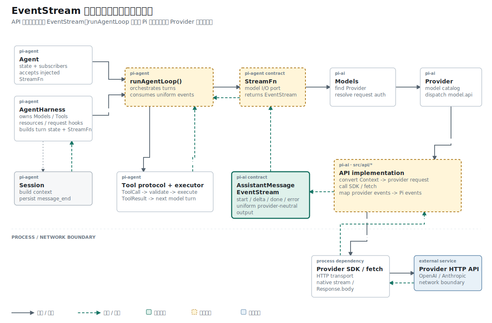

## 名词约定：过程、结果与编排属于不同对象

| 名称 | 本文含义 |
| --- | --- |
| Agent Runtime | 负责调用模型、消费增量、处理工具并维护对话推进的运行机制 |
| Agent Loop | Runtime 中反复执行“调用模型 -> 读取结果 -> 决定下一步”的编排循环 |
| `EventStream<T, R>` | 过程侧可异步遍历 `T` 事件、结果侧可等待最终 `R` 的对象 |
| wrapper | API implementation 中包住一次网络请求的外层函数，负责 `start/done/error` 生命周期 |
| Adapter / API implementation | 把 Provider 原生请求与事件翻译成 Pi 类型的协议模块 |

EventStream 是数据合同，Agent Loop 是消费者，wrapper 是生产者所在的请求边界。

## 结论先行

本篇主张：模型流必须同时提供“过程事件”和“最终结果”，并让两者共享同一个终止条件。

推理链如下：

```text
前提 1：终端需要在模型生成期间读取增量。
前提 2：Agent Loop 需要在生成结束后取得完整 AssistantMessage。
结论 1：Promise 和 AsyncIterator 分别表达两个时间尺度。

前提 3：成功、失败和取消都会结束一次模型调用。
前提 4：若迭代器与最终 Promise 各自判断结束，二者可能产生矛盾状态。
结论 2：EventStream 必须用同一终止事件关闭过程读取并完成最终结果。
```

## 已知事实：最终字符串不足以支撑 Agent Runtime

最早的 `callOpenAI()` 等待完整 HTTP 响应后返回字符串。改成 Agent Runtime 后，上层同时需要增量事件和最终 `AssistantMessage`。

## 事实一：`Promise<string>` 只表达请求结束后的状态

最小网络函数的调用方式是：

```ts
const text = await callOpenAI(config, prompt);
console.log(text);
```

`await` 恢复时，请求已经结束。调用方看不到请求开始、文本增量、工具参数增量或失败前的部分输出。

Agent Runtime 的消费者至少有两种：终端需要逐段渲染，Agent Loop 需要在流结束后得到带 usage、stopReason 和 ToolCall 的最终消息。一个 `Promise<string>` 无法同时表达这两个时间尺度。

新的 `StreamFunction` 接收 Model、`Context` 和请求选项，立即返回 `AssistantMessageEventStream`。最终 `AssistantMessage` 再携带 `Usage`、停止原因和内容块。这里先建立调用合同，后续 Adapter 才负责填充这些字段。

这次改动同时定义了事件流两端使用的数据：

```text
StreamOptions / SimpleStreamOptions  本次请求的 apiKey、maxTokens
UserMessage / AssistantMessage      输入历史与最终回复
TextContent                         AssistantMessage 中的文本块
Usage / StopReason                  Token 统计与终止状态
Message / Context                   一次调用携带的对话
AssistantMessageEvent               start、done、error
```

这些类型先支持文本和三种生命周期事件。后续文章会在同一个联合类型中加入 `text_*` 与 `toolcall_*`。

## 问题定义：两个消费者必须观察同一次调用

两类消费者关心的信息不同：

```ts
for await (const event of stream) {
  // start、delta、done、error
}

const message = await stream.result();
```

如果过程事件和最终结果各自维护状态，失败、取消或完成时容易出现一边结束、另一边仍然等待的情况。

## 机制一：四组状态连接生产者与消费者

`EventStream<T, R>` 引入四组状态：

```ts
private queue: T[] = [];
private waiting: ((value: IteratorResult<T>) => void)[] = [];
private done = false;
private finalResultPromise: Promise<R>;
```

`push()` 优先唤醒已经等待的消费者，否则把事件放入队列。遇到终止事件时，它从事件中提取最终结果并完成 `finalResultPromise`：

```ts
push(event: T): void {
  if (this.done) return;

  if (this.isComplete(event)) {
    this.done = true;
    this.resolveFinalResult(this.extractResult(event));
  }

  const waiter = this.waiting.shift();
  if (waiter) waiter({ value: event, done: false });
  else this.queue.push(event);
}
```

`AssistantMessageEventStream` 再把通用结束规则固定为 `done` 或 `error`。

异步遍历入口由 `[Symbol.asyncIterator]()` 提供，因此类实例可以直接用于 `for await ... of`：

```ts
async *[Symbol.asyncIterator](): AsyncIterator<T> {
  // queue、done 与 waiting 三个分支
}
```

## 机制二：到达顺序决定唤醒还是入队

生产者和消费者到达顺序不固定。EventStream 分别处理两种情况。

消费者先等待时，异步迭代器把自己的 `resolve` 放进 `waiting`：

```ts
const result = await new Promise<IteratorResult<T>>((resolve) =>
  this.waiting.push(resolve),
);
```

生产者随后 `push(event)`，直接唤醒最早的等待者：

```ts
const waiter = this.waiting.shift();
if (waiter) {
  waiter({ value: event, done: false });
}
```

生产者先到达时，没有 waiter，事件进入 `queue`。消费者之后从队首读取：

```ts
if (this.queue.length > 0) {
  yield this.queue.shift()!;
}
```

这两个分支让测试中的同步 `push()` 和真实网络中的异步 delta 使用同一套代码。

## 概念约束：`done` 事件与 `end()` 不是同一件事

`done` 或 `error` 是协议事件，调用方应该能够读到它。`end()` 是 AsyncIterator 的结束信号，不携带业务事件。

```text
push(done)  -> 迭代器读到 done；result() 完成
end()       -> 等待下一项的迭代器收到 { done: true }
```

wrapper 通常先 `push({ type: "done" })`，再调用 `end()`。对当前单消费者实现，`push(done)` 已经会交付终止事件、完成 `result()` 并让消费者在下一次迭代时退出；后续 `end()` 是显式收尾，也能唤醒误用场景中的其他 waiter。单独调用无参数 `end()` 时，没有终止事件提供最终消息，`result()` 会一直等待。

## 拓扑位置：Provider 与 Agent Loop 之间的统一合同

API implementation 创建并写入这个流。`Models`、Provider 和 `StreamFn` 只把同一个对象返回给上层。`runAgentLoop()` 使用 `for await` 处理消息更新，在终止事件到达后调用 `result()` 获取最终消息。

它属于 Provider 与 Agent Loop 之间的数据协议，不负责 HTTP、Provider 事件解析或工具执行。

## 因果链：为什么网络请求必须在后台推进

Adapter 需要立即把 EventStream 返回给调用方，因此网络请求运行在后台异步函数中：

```ts
export const streamSimple = (model, context, options) => {
  const stream = new AssistantMessageEventStream();

  void (async () => {
    try {
      stream.push({ type: "start", partial: createMessage(model, "") });

      const response = await fetch(url, requestInit);
      if (!response.ok) throw new Error(await response.text());

      await processResponsesStream(
        parseResponsesSse(response),
        output,
        stream,
        model,
      );

      stream.push({ type: "done", reason: output.stopReason, message: output });
      stream.end();
    } catch (error) {
      const message = createErrorMessage(model, error);
      stream.push({ type: "error", reason: "error", error: message });
      stream.end(message);
    }
  })();

  return stream;
};
```

调用方拿到 `stream` 时，`fetch()` 可能尚未完成。网络事件随后由同一个对象交付给 `for await`，终止事件再完成 `result()`。这段代码解释了 EventStream 为什么同时需要事件队列和最终 Promise。

## 证据边界：一次测试同时关闭两种读取方式

自动测试名称直接描述两个验收面：`AssistantMessageEventStream yields events and returns final message`。

测试中的 `assistant()` 负责构造合法的部分消息和最终消息，`readStream()` 使用 `for await` 收集事件。两个 helper 让用例只关注事件顺序与 `result()` 返回值。

测试先启动异步消费者，再推入开始和完成事件：

```ts
const reader = (async () => {
  for await (const event of stream) seen.push(event.type);
})();

stream.push({ type: "start", partial });
stream.push({ type: "done", reason: "stop", message: final });
stream.end(final);

const result = await stream.result();
await reader;

assert.deepEqual(seen, ["start", "done"]);
assert.equal(result, final);
```

这个用例同时证明终止事件仍会被迭代器读到，`result()` 也会完成。

## 适用范围：当前实现只保证单消费者

当前实现按单消费者设计。多个消费者会竞争队列中的事件，它不提供广播或事件重放。队列也没有容量限制，生产速度长期高于消费速度时会累积内存。这些能力不影响当前单个 Agent Loop 的使用方式。

另一个边界是错误表示。Provider 请求失败后，wrapper 会创建 `stopReason: "error"` 的 AssistantMessage，并通过 `error` 事件结束。EventStream 不格式化 OpenAI 或 Anthropic 错误，它只保证失败也能完成 `result()`。

## 推理复核

| 结论 | 推理方式 | 当前证据 |
| --- | --- | --- |
| 过程事件和最终消息可以共存 | 构造性证明 | 同一测试既遍历事件又等待 `result()` |
| `done` 到达后 `result()` 必须完成 | 演绎：`isComplete()` 触发最终 Promise | 生命周期测试覆盖 |
| `end()` 等同于成功完成 | 不成立 | 无终止事件的 `end()` 不提供最终结果 |
| EventStream 支持广播 | 不成立 | 多消费者会竞争同一个队列 |

这里最重要的同一律约束是：终止事件在迭代视角和结果视角中必须指向同一次模型调用。

## 结果与当前阶段

统一事件流已经成为 OpenAI 与 Anthropic Adapter 的返回类型。后续工作集中在让每个 Provider 原生事件完整映射为 `AssistantMessageEvent`，而不是修改 EventStream 的生命周期。

下一篇把 Model、Auth 和 EventStream 装进 Provider，形成第一个统一的模型调用入口。

## 复现资料

- 实现：`packages/ai/src/utils/event-stream.ts`
- 事件类型：`packages/ai/src/types.ts`
- 测试：`packages/ai/test/event-stream.test.ts`
- 参考：`~/remake-pi/pi/packages/ai/src/utils/event-stream.ts`
- 验证：`npm test -- packages/ai/test/event-stream.test.ts`
