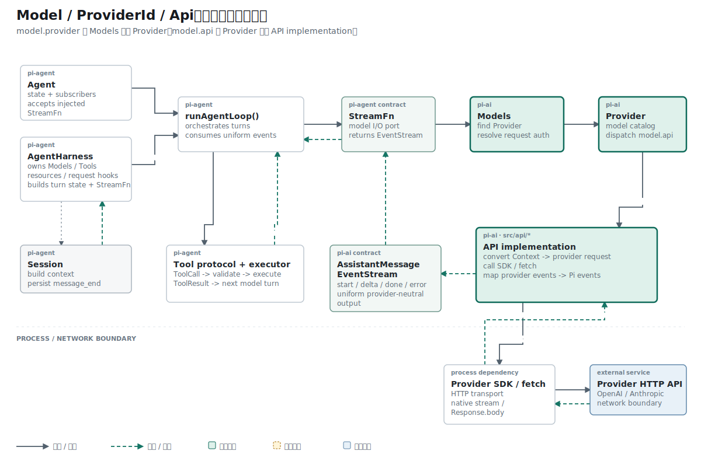

## 结论先行

本篇主张：重建 Pi Agent Core 应先关闭最小 HTTP 回路，再定义 Provider 抽象。

推理链如下：

```text
前提 1：仓库尚未证明 URL、API Key、请求体和响应结构能够工作。
前提 2：完整 Pi 调用链包含多个可以独立失败的环节。
结论 1：第一步只验证 HTTP 请求，减少同时存在的未知量。

前提 3：HTTP 跑通后，可以观察哪些数据稳定、哪些数据随模型或服务商变化。
前提 4：后续需要同时支持 OpenAI 和 MiniMax。
结论 2：把变化项从局部配置中抽出，形成 Model、ProviderId 与 Api。
```

第一部分建立事实，第二部分根据事实建立类型。这个顺序避免先设计一套看似完整、却没有运行证据的架构。

## 背景：目标很大，起点很小

目标仓库 `~/i` 用 TypeScript 重新实现 `~/remake-pi/pi` 中与 Agent Runtime 有关的机制。参考 Pi 的模型调用路径已经包含：

```text
Agent / AgentHarness
  -> runAgentLoop()
  -> StreamFn
  -> Models
  -> Provider
  -> API implementation
  -> SDK / HTTP
  -> external Provider API
```

仓库起步时，`packages/ai/src` 下面只有一个空的 `openai-codex.ts`。Provider、Context、EventStream、Agent Loop 和自动测试都还没有出现。

若从完整调用链开始复制，一次失败可能来自认证、模型选择、消息转换、HTTP、SSE 或事件映射。此时无法确定应该先修哪一层。

因此第一个问题被收窄为：给定 URL、API Key、模型 ID 和 prompt，能否收到 OpenAI Responses API 的成功响应？

## 第一个闭环：27 行代码直接请求网络

第一版只定义局部配置：

```ts
type OpenAIConfig = {
  apiKey: string;
  baseUrl: string;
  model: string;
};
```

`callOpenAI()` 完成 URL、认证、请求体、错误处理和 JSON 读取：

```ts
export async function callOpenAI(
  config: OpenAIConfig,
  prompt: string,
) {
  const url = `${config.baseUrl.replace(/\/+$/, "")}/responses`;

  const res = await fetch(url, {
    method: "POST",
    headers: {
      authorization: `Bearer ${config.apiKey}`,
      "content-type": "application/json",
    },
    body: JSON.stringify({
      model: config.model,
      input: prompt,
    }),
  });

  if (!res.ok) {
    throw new Error(await res.text());
  }

  return await res.json();
}
```

这段代码固定了五项可以观察的网络事实：

| 问题 | 代码给出的答案 |
| --- | --- |
| 请求发到哪里 | `POST {baseUrl}/responses` |
| 怎样认证 | `authorization: Bearer <apiKey>` |
| 发送什么 | `{ model, input }` |
| HTTP 失败怎样处理 | 检查 `res.ok`，读取错误文本 |
| 成功后得到什么 | `res.json()` 返回 Provider JSON |

收到成功响应后，可以确认 endpoint、凭证和最小 payload 能够共同工作。这项结果尚未证明多轮消息、流式事件、工具调用或 Agent Loop。

## 手工脚本怎样提供运行证据

根目录先加入 `dotenv`，随后用 ES Module 运行 TypeScript 文件：

```json
{
  "type": "module",
  "dependencies": {
    "dotenv": "^17.4.2"
  }
}
```

手工脚本加载 `.env`：

```ts
import { config } from "dotenv";
import { callOpenAI } from "../src/providers/openai-responses.ts";

config({ override: true });

async function main() {
  const result = await callOpenAI(
    {
      apiKey: process.env.OPENAI_API_KEY!,
      baseUrl: process.env.OPENAI_BASE_URL!,
      model: "gpt-5.5",
    },
    "Say hi",
  );

  console.log(JSON.stringify(result, null, 2));
}
```

运行时路径只有六步：

```text
.env
  -> OpenAIConfig
  -> callOpenAI()
  -> fetch(POST /responses)
  -> res.json()
  -> console.log()
```

`main()` 的异常分支只负责打印错误并设置退出码。脚本依赖真实网络和本机 Key，属于 smoke test；它没有固定输入响应，也没有断言结果，因此无法承担自动回归。

## 第一次收窄：从 Provider JSON 到文本

初始函数返回完整 JSON，调用方必须理解 `output[].content[]`。下一次变化把文本提取留在请求模块内部：

```ts
const data = await res.json();

return data.output
  .flatMap((item) => item.content ?? [])
  .filter((part) => part.type === "output_text")
  .map((part) => part.text)
  .join("");
```

推导过程是：

```text
前提：output、content 和 output_text 都属于 OpenAI Responses 协议。
前提：上层当前只需要 assistant 文本。
结论：协议字段应由请求模块解释，上层接收字符串。
```

这次变化仍然丢失 response ID、Token 用量和停止原因。后续 `AssistantMessage` 会承载这些数据。

## 最小实现暴露了哪些变化项

HTTP 闭环跑通后，`OpenAIConfig` 的局限变得具体：

| 已有字段或行为 | 暴露的问题 | 后续归属 |
| --- | --- | --- |
| `model: string` | 无法表达能力与 Token 限制 | `Model` |
| `apiKey` | 调用脚本自行选择凭证来源 | Auth |
| 文件位于 `providers/` | 服务商和线上协议混在一个名字中 | Provider / API implementation |
| `input: prompt` | 无法表达 system prompt 和多轮历史 | Context conversion |
| `res.json()` | 只能等待最终结果 | EventStream / SSE parser |
| 返回字符串 | 缺少 usage、response ID、stop reason | `AssistantMessage` |

这些问题来自已经运行的代码。后续抽象分别对应一个已经观察到的变化维度。

## 基础类型：先固定概念的含义

代码先定义内置名称，同时保留外部扩展能力：

```ts
export type KnownApi =
  | "openai-responses"
  | "anthropic-messages";

export type Api = KnownApi | (string & {});

export type KnownProvider =
  | "openai"
  | "minimax";

export type ProviderId = KnownProvider | (string & {});

export type ProviderEnv = Record<string, string>;
export type ProviderHeaders = Record<string, string | null>;
```

本文中的概念保持以下含义：

| 概念 | 含义 | 示例 |
| --- | --- | --- |
| Provider | 提供模型、凭证和 endpoint 的服务商 | `openai`、`minimax` |
| Api | HTTP 请求与响应遵循的协议 | `openai-responses`、`anthropic-messages` |
| Model | 一项可调用模型的完整运行配置 | 模型 ID、Provider、Api、能力、限制 |

`KnownApi` 与 `KnownProvider` 提供内置值提示。`Api` 与 `ProviderId` 允许外部注册新字符串。`ProviderEnv` 保存额外 Provider 配置，`ProviderHeaders` 表示可合并的 HTTP headers。

## Model 把变化项组织成一个对象

`Model` 按四组信息组织字段：

```ts
export interface Model<TApi extends Api = Api> {
  // 身份
  id: string;
  name: string;

  // 路由
  api: TApi;
  provider: ProviderId;
  baseUrl: string;

  // 能力
  reasoning: boolean;
  input: ("text" | "image")[];

  // 限制
  contextWindow: number;
  maxTokens: number;
}
```

这个接口把原来 `OpenAIConfig.model` 的一个字符串扩展为可用于路由、能力判断和请求限制的配置对象。

## 为什么 Provider 和 Api 必须分开

区分可以通过三个前提推出：

```text
前提 1：Provider 决定服务商身份、凭证来源和模型目录。
前提 2：Api 决定 endpoint 形状、请求字段和流式事件。
前提 3：MiniMax-M3 属于 MiniMax，同时使用 Anthropic Messages 协议。
结论：一个字段无法同时准确表达服务商身份和线上协议。
```

模型目录把两个值分别记录：

```ts
export const MINIMAX_MODELS = {
  "MiniMax-M3": {
    id: "MiniMax-M3",
    name: "MiniMax-M3",
    api: "anthropic-messages",
    provider: "minimax",
    baseUrl: "https://api.minimax.io/anthropic",
    reasoning: true,
    input: ["text", "image"],
    contextWindow: 1_000_000,
    maxTokens: 128_000,
  } satisfies Model<"anthropic-messages">,
};
```

这里的 `provider` 回答“由谁提供”，`api` 回答“按什么协议调用”。两个问题拥有不同答案。

## 两个字段在完整调用路径中怎样使用

参考 Pi 先按 `model.provider` 查找 Provider：

```text
Models.streamSimple(model)
  -> requireProvider(model.provider)
  -> Provider
```

Provider 再按 `model.api` 选择 API implementation：

```text
Provider
  -> apiFor(model.api)
  -> OpenAI Responses 或 Anthropic Messages implementation
```

最后由协议实现使用 `model.baseUrl` 和 `model.id` 发出 HTTP 请求。

当前项目尚未实现参考 Pi 的 `Models` 集合。`model.provider` 已进入类型和模型目录，但还没有参与统一运行时查找；当前 `createProvider()` 也只绑定单个 API implementation。

## 自动测试证明了什么

后续 Provider 测试固定了两组合法组合。OpenAI 用例为：

```ts
const provider = openaiProvider();
const model = provider.getModels()[0];
assert.ok(model);
assert.equal(model.provider, "openai");
assert.equal(model.api, "openai-responses");
```

MiniMax 用例为：

```ts
const provider = minimaxProvider();
const model = provider.getModels()[0];
assert.ok(model);
assert.equal(model.provider, "minimax");
assert.equal(model.api, "anthropic-messages");
```

这两项断言证明模型目录没有混淆服务商和协议。它们不访问网络，也没有证明 `Models` 会根据字段完成两次分派。HTTP 请求由手工 smoke 验证，模型字段由自动测试验证，两种证据的范围不同。

## 推理复核

本篇包含两种推理强度：

| 结论 | 推理方式 | 证据强度 |
| --- | --- | --- |
| 最小 OpenAI 请求能够访问网络 | 直接运行与观察 | 只覆盖当时的 URL、Key、模型和 prompt |
| 协议解析应留在请求模块 | 从调用方依赖中归纳 | 工程设计结论，可由模块边界继续检验 |
| Provider 与 Api 需要两个字段 | 根据定义和 MiniMax 反例演绎 | 若两者含义保持不变，结论成立 |
| 当前已经具备完整 Pi 分派 | 不成立 | `Models` 尚未实现 |

最后一行用于排除过度结论：网络成功与 Agent Core 完成属于两个命题，前者不能推出后者。

## 结果与当前阶段

第一阶段获得了两类结果。运行结果证明 `.env -> fetch -> JSON` 的网络闭环可以工作；类型结果把模型身份、服务商、协议、能力和限制从局部 `OpenAIConfig` 中抽出。

下一篇处理 `OpenAIConfig.apiKey` 的去向：凭证怎样从已存数据或环境变量解析成一次请求可以直接使用的 `ModelAuth`。

## 复现资料

- 初始网络实现：历史文件 `packages/ai/src/providers/openai-responses.ts`
- 当前类型：`packages/ai/src/types.ts`
- 模型目录：`packages/ai/src/providers/minimax.models.ts`
- 自动测试：`packages/ai/test/provider.test.ts`
- 参考：`~/remake-pi/pi/packages/ai/src/types.ts`、`~/remake-pi/pi/packages/ai/src/models.ts`
- 验证：`npm test -- packages/ai/test/provider.test.ts`
