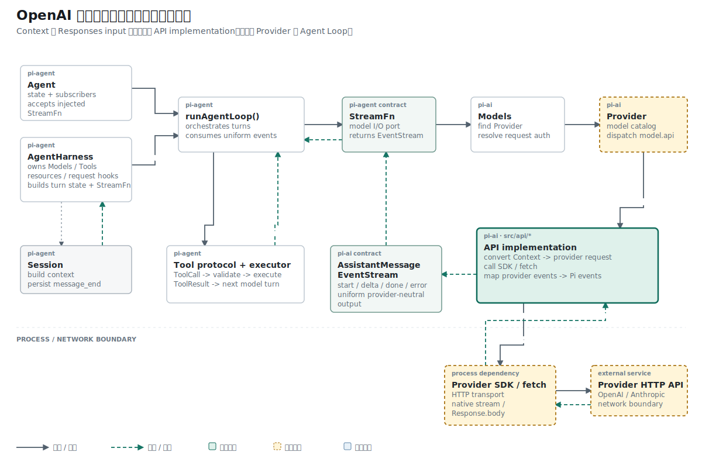

## 结论先行

本篇主张：`Context` 到 OpenAI Responses `input[]` 的转换必须成为独立纯函数，网络 wrapper 只消费转换结果。

推理链如下：

```text
前提 1：Agent Runtime 保存的是 Provider 无关的完整 Context。
前提 2：OpenAI Responses 要求协议专用的 input item。
结论 1：两种表示之间必须存在显式转换。

前提 3：旧实现只提取最后一条 user 消息。
前提 4：丢失 system prompt 或历史消息会改变模型实际收到的问题。
结论 2：转换必须遍历完整 Context，并能脱离网络独立验证。
```

## 已知事实：旧 wrapper 只保留最后一句 user 输入

早期 wrapper 用 `promptFromContext()` 倒序寻找最后一条 user 消息。单轮请求可以工作，但 system prompt、assistant 历史和更早的 user 消息都不会发送。

## 矛盾：接口接收完整 Context，实现却压缩为字符串

Provider 已经能把 `model`、`context` 和 `options` 委托给 OpenAI Adapter：

```ts
provider.streamSimple(model, context, options);
```

接口看起来已经接收完整 Context，内部却把它压缩成一个字符串：

```ts
function promptFromContext(context: Context): string {
  const lastUser = [...context.messages]
    .reverse()
    .find((message) => message.role === "user");

  return lastUser?.content ?? "";
}
```

两轮对话输入时，第一轮 user 消息和 assistant 回答都会丢失。Provider 接口完成了，协议转换仍然只支持最小单轮切片。

## 问题定义：稳定 Context 如何进入协议对象

Agent Loop 保存的是 Provider 无关的 `Context`：

```ts
export interface Context {
  systemPrompt?: string;
  messages: Message[];
}
```

OpenAI Responses 需要自己的 `input[]` 结构。转换逻辑应接受完整 Context，并在不执行 `fetch()` 的情况下测试。

本地联合类型 `ResponsesInputItem` 列出当前支持的三种请求项：system/developer 指令、user input text、已完成的 assistant output message。它让转换函数的返回值在发请求前接受 TypeScript 检查。

## 机制：按原顺序生成三类 Responses item

第一步用 `inputFromContext()` 替换“最后一句 prompt”，按原顺序转换所有消息。第二步把函数移到 `openai-responses-shared.ts`，命名为 `convertResponsesMessages()`，让网络 wrapper 只负责请求与流生命周期。

```ts
export function convertResponsesMessages(model, context) {
  const input = [];

  if (context.systemPrompt) {
    input.push({
      role: model.reasoning ? "developer" : "system",
      content: context.systemPrompt,
    });
  }

  for (const message of context.messages) {
    if (message.role === "user") {
      input.push({
        role: "user",
        content: [{ type: "input_text", text: message.content }],
      });
      continue;
    }

    const text = message.content
      .filter((block) => block.type === "text")
      .map((block) => block.text)
      .join("");

    if (text) input.push({
      type: "message",
      role: "assistant",
      content: [{ type: "output_text", text, annotations: [] }],
      status: "completed",
    });
  }

  return input;
}
```

## 概念约束：三种消息保持各自语义

system prompt 不在 `messages[]` 中，Responses API 需要把它放进独立 input item：

```ts
input.push({
  role: model.reasoning ? "developer" : "system",
  content: context.systemPrompt,
});
```

reasoning 模型使用 `developer`，普通模型使用 `system`。这个选择属于 OpenAI 协议兼容逻辑，不进入通用 Context。

user 消息转换为 `input_text`：

```ts
{
  role: "user",
  content: [{ type: "input_text", text: message.content }],
}
```

assistant 文本转换为已完成的 output message：

```ts
{
  type: "message",
  role: "assistant",
  content: [{
    type: "output_text",
    text,
    annotations: [],
  }],
  status: "completed",
}
```

转换保持原始消息顺序。Responses API 收到的是完整对话记录，不需要通过“最后一句 prompt”推断上下文。

## 拓扑位置：转换只发生在选定的 API implementation 内

Session、Agent 和 Agent Loop 都保留 Pi 消息。只有被选中的 API implementation 才转换 Provider 请求格式。这个边界让同一段 Context 可以分别交给 OpenAI Responses 或 Anthropic Messages。

参考 Pi 的 OpenAI 转换还会重放工具调用、工具结果、图片、reasoning 与 Provider 特定签名。当前切片只覆盖文本。

## 因果链：转换结果怎样进入 HTTP body

`convertResponsesMessages()` 的返回值没有被存入 Session。它只在发请求前生成 Provider payload：

```ts
const input = convertResponsesMessages(model, context);

const response = await fetch(
  `${model.baseUrl.replace(/\/+$/, "")}/responses`,
  {
    method: "POST",
    headers: {
      authorization: `Bearer ${options.apiKey}`,
      "content-type": "application/json",
    },
    body: JSON.stringify({
      model: model.id,
      input,
      stream: true,
    }),
  },
);
```

对应的 HTTP body 形状如下：

```json
{
  "model": "gpt-test",
  "input": [
    { "role": "system", "content": "Be concise." },
    {
      "role": "user",
      "content": [{ "type": "input_text", "text": "Hello" }]
    }
  ],
  "stream": true
}
```

转换函数改错时，网络仍可能返回 200，但模型看到的对话会缺失。纯转换测试负责请求内容，wrapper 测试再负责 URL、header、HTTP 方法和事件返回。

## 证据边界：纯函数测试关闭请求内容

默认测试 `convertResponsesMessages maps Pi context to OpenAI Responses input` 把 system、user 和 assistant 三种输入放在同一个 Context 中。

纯函数测试输入一段 system、user、assistant 历史，直接比较 `input[]`：

```ts
const input = convertResponsesMessages(model, {
  systemPrompt: "Be concise.",
  messages: [
    { role: "user", content: "Hello", timestamp: 1 },
    assistant,
  ],
});

assert.deepEqual(input, [
  { role: "system", content: "Be concise." },
  { role: "user", content: [{ type: "input_text", text: "Hello" }] },
  {
    type: "message",
    role: "assistant",
    content: [{ type: "output_text", text: "Hi there", annotations: [] }],
    status: "completed",
  },
]);
```

测试证明 system、user 和 assistant 文本被按顺序转换。它没有访问网络，也没有证明 URL、header 或 `stream: true` 正确；这些命题由 wrapper 测试承担。

## 推理复核

| 结论 | 推理方式 | 当前证据 |
| --- | --- | --- |
| 完整文本历史能够进入 Responses 请求 | 构造与等值比较 | 纯函数测试比较完整 `input[]` |
| reasoning 模型应使用 `developer` 角色 | 协议规则映射 | `model.reasoning` 分支位于转换函数 |
| ToolCall 已能重放给 OpenAI | 不成立 | 当前只筛选 `type: "text"` |
| 转换函数正确即可证明网络调用正确 | 不成立 | HTTP 行为由另一层 wrapper 决定 |

这一区分防止把“请求对象正确”和“请求已经发送”合并成同一个结论。

## 结果与当前阶段

文本历史转换已经脱离网络并进入默认测试。当前 `AssistantMessage` 中的 ToolCall 会被过滤，项目也没有 ToolResult 消息类型，因此工具调用完成后还不能把执行结果重放给 OpenAI。

下一篇开始处理返回方向：OpenAI SSE 中的 output item 和 delta 如何逐步形成一条 AssistantMessage。

## 复现资料

- 实现：`packages/ai/src/api/openai-responses-shared.ts`
- 测试：`packages/ai/test/openai-responses-conversion.test.ts`
- 参考：`~/remake-pi/pi/packages/ai/src/api/openai-responses-shared.ts`
- 验证：`npm test -- packages/ai/test/openai-responses-conversion.test.ts`
