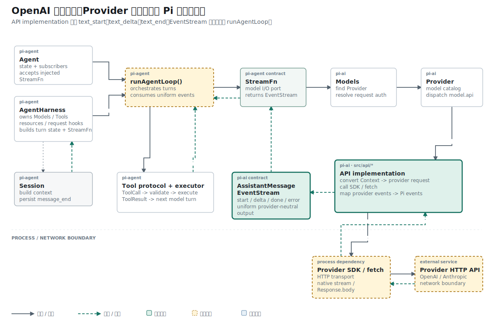

## 结论先行

本篇主张：文本状态只有在创建、变化和完成三个边界上发布事件，流式生成才对上层可观察；这些事件必须引用同一个 `contentIndex` 和同一份部分消息。

推理链如下：

```text
前提 1：解析器内部更新文本，不会自动通知终端或 Agent Loop。
前提 2：上层既需要本次 delta，也需要截至当前的完整部分消息。
结论 1：每次状态变化都要发布对应的 Pi progress event。

前提 3：一条回复可能同时包含文本、工具调用和其他内容块。
前提 4：数组位置会随内容块创建顺序变化。
结论 2：start、delta、end 必须沿用创建时确定的 contentIndex。
```

## 已知事实：内部状态变化不会自动变成外部事件

第一版文本状态机能够在 `processResponsesStream()` 返回后得到完整 `AssistantMessage`。终端或 UI 在此之前没有更新信号，流式请求的体验仍等同于最终 JSON。

## 矛盾：状态已经变化，消费者仍然不可见

只修改 `output.content` 时，parser 内部已经拥有 `Hel`、`Hello` 等中间状态，但外部消费者没有通知入口：

```text
network delta -> output.content changes -> parser returns -> caller sees Hello
```

EventStream 已经存在，因此缺失的部分是 Provider event 到 Pi progress event 的映射。每次状态变化需要在发生时发布，同时保留最终消息作为唯一完整状态。

## 问题定义：过程事件需要保存哪些信息

过程事件需要表达三件事：内容块何时建立，本次新增了什么，内容块何时完成。每个事件还要携带稳定的 `contentIndex`，使消费者能更新正确位置。

## 机制：在三个状态边界发布事件

message item 建立时，解析器先把 block 写入 `output.content`，再发布开始事件：

```ts
stream.push({
  type: "text_start",
  contentIndex,
  partial: output,
});
```

每个 delta 先更新 block，再发布本次增量：

```ts
slot.block.text += event.delta;
stream.push({
  type: "text_delta",
  contentIndex: slot.contentIndex,
  delta: event.delta,
  partial: output,
});
```

`response.output_item.done` 到达后，解析器使用 Provider 给出的最终文本校正 block，发布 `text_end`，然后删除 slot：

```ts
stream.push({
  type: "text_end",
  contentIndex: slot.contentIndex,
  content: slot.block.text,
  partial: output,
});

textSlots.delete(event.output_index);
```

统一事件类型把最终文本声明为 `content: string`，因此消费者在 `text_end` 到达后不需要再次读取 Provider item。

## 概念约束：`delta`、`partial` 与 `contentIndex` 各有职责

`text_delta` 中的两个字段服务不同用途：

```ts
{
  type: "text_delta",
  contentIndex: 0,
  delta: "Hel",
  partial: output,
}
```

`delta` 适合终端直接追加字符。`partial` 保存到当前时刻为止的完整 AssistantMessage，Agent Loop 可以用它替换 transcript 中的 streaming message。

`contentIndex` 不能固定为 0。Responses 可能同时生成文本、工具调用和 reasoning，内部 `content[]` 的位置取决于到达顺序。它在 block 创建时计算，后续 start、delta 和 end 使用同一个值。

## 拓扑位置：API implementation 向 Agent Loop 发布统一事件

API implementation 把 OpenAI 原生事件翻译成 `AssistantMessageEvent`。`runAgentLoop()` 消费统一的 `text_*` 事件并发布消息更新，不需要识别 `response.output_text.delta`。

parser 的结束边界停在内容块。整条回复的 `start`、`done` 和 `error` 由 wrapper 管理，因为只有 wrapper 知道请求是否成功完成。

## 因果链：网络增量怎样到达上层

调用方在 `fetch()` 完成前已经拿到 EventStream，可以立即开始读取：

```ts
const response = provider.streamSimple(model, context, options);

for await (const event of response) {
  if (event.type === "text_delta") {
    terminal.write(event.delta);
  }
}

const finalMessage = await response.result();
```

参考 Pi 的 `runAgentLoop()` 采用相同消费方式。它把 Provider 的 `text_*` 事件转换为 Agent 的 `message_update`：

```ts
for await (const event of response) {
  switch (event.type) {
    case "text_start":
    case "text_delta":
    case "text_end":
      partialMessage = event.partial;
      context.messages[context.messages.length - 1] = partialMessage;
      await emit({
        type: "message_update",
        assistantMessageEvent: event,
        message: { ...partialMessage },
      });
      break;
  }
}
```

从 HTTP SSE 到终端增量，中间没有再次拼接一份文本。Adapter 修改 `partial`，Agent Loop 只转发状态变化。

参考 Pi 在转发前使用 `{ ...partialMessage }` 创建浅层消息快照。内容块仍由 Adapter 管理，消费者不应修改 `event.partial`。

## 证据边界：四步序列证明内容块生命周期

默认用例 `processResponsesStream emits text progress events` 覆盖从 block 创建到完成的四步通知。

测试在解析前启动消费者，并记录事件类型：

```ts
const reader = (async () => {
  for await (const event of stream) seen.push(event.type);
})();

await processResponsesStream(events(), output, stream, model);
stream.end(output);
await reader;

assert.deepEqual(seen, [
  "text_start",
  "text_delta",
  "text_delta",
  "text_end",
]);
```

测试手动调用 `stream.end(output)`，因为被测函数只负责 Provider event，终止事件属于 wrapper。

## 推理复核

| 结论 | 推理方式 | 当前证据 |
| --- | --- | --- |
| 每次文本增量都对消费者可见 | 事件序列验证 | 测试得到两个 `text_delta` |
| `contentIndex` 在生命周期内保持稳定 | 状态不变式 | slot 在 start 时保存索引，delta/end 复用 |
| `partial` 与最终消息是两份独立拼接结果 | 不成立 | 事件引用同一个可变 `output` |
| parser 负责整条请求的 `done/error` | 不成立 | 测试需手动收尾，wrapper 管理外层生命周期 |

同一律在这里表现为身份保持：一次文本内容块从开始到结束始终由同一个索引标识。

## 结果与当前阶段

文本内容和过程事件使用同一个可变 block，避免两套拼接状态。wrapper 集成测试进一步验证完整序列包含外层的 `start` 和 `done`。

下一篇沿用 `output_index -> contentIndex` 的映射方法，把 function call 参数加入 AssistantMessage。

## 复现资料

- 实现：`packages/ai/src/api/openai-responses-shared.ts`
- 事件类型：`packages/ai/src/types.ts`
- 测试：`packages/ai/test/openai-responses-stream.test.ts`
- 参考：`~/remake-pi/pi/packages/ai/src/api/openai-responses-shared.ts`
- 验证：`npm test -- packages/ai/test/openai-responses-stream.test.ts`
