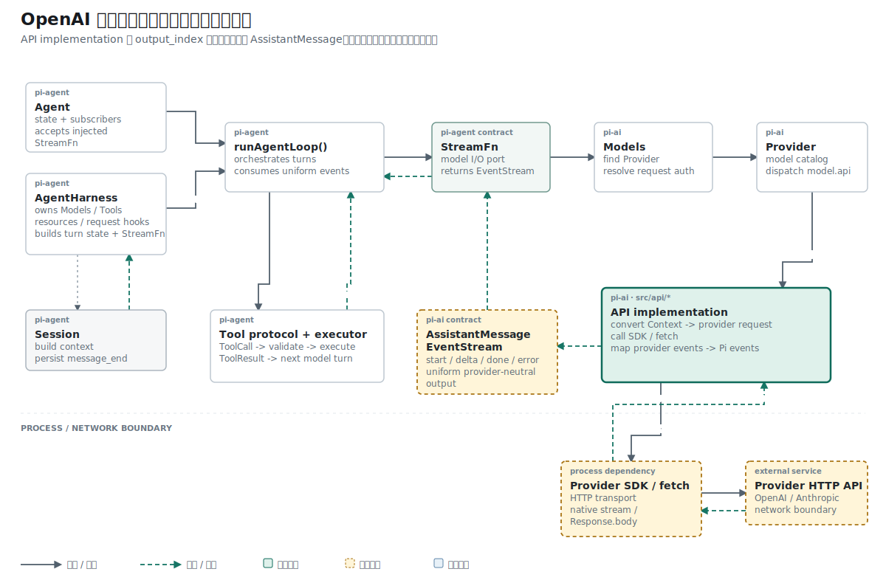

## 名词约定：事件、解析器与状态机不能混用

| 名称 | 本文含义 |
| --- | --- |
| Provider event | OpenAI SSE data 中解析出的协议事件，例如 `response.output_text.delta` |
| parser / 解析器 | 读取 Provider event，并把它们转换为 Pi 消息状态的函数 |
| 状态机 | 根据事件类型与先后顺序更新内部状态的一组规则；这里由 `textSlots` 和分支共同实现 |
| slot | 以 `output_index` 为键保存的临时映射，指向正在形成的 Pi 内容块 |
| wrapper | 提供 HTTP Response、处理请求级错误并最终发送 `done/error` 的外层函数 |

Provider event 是输入数据，parser 是执行转换的代码，状态机是 parser 遵守的状态变化规则。

## 结论先行

本篇主张：OpenAI 文本流必须用 `output_index` 建立 Provider 输出项到 Pi 内容块的稳定映射，增量事件只能修改该映射指向的对象。

推理链如下：

```text
前提 1：一个 Responses 流可以包含多个 output item。
前提 2：文本 delta 只携带 output_index 和新增文本。
结论 1：解析器必须保存 output_index 对应的内部内容块。

前提 3：网络结束可能发生在 response.completed 之前。
前提 4：部分文本不能等同于正常完成的 AssistantMessage。
结论 2：协议完成事件和传输结束必须分别检查。
```

## 已知事实：Provider delta 不是最终消息

OpenAI Responses 的流由多种事件组成。`response.output_text.delta` 只携带新增文本和 `output_index`，它没有最终 AssistantMessage，也不保证响应中只有一个输出项。

## 历史事实：非流式版本只构造一次消息

OpenAI wrapper 最初发送普通请求，然后一次性读取 JSON：

```ts
const data = await res.json();
const message = createMessage(
  model,
  outputText(data),
  data,
);

stream.push({ type: "done", reason: "stop", message });
```

这个版本只需要在请求结束后构造一次消息。请求体增加 `stream: true` 后，`res.json()` 不再适用，HTTP body 变成连续 SSE 帧。解析器必须在响应尚未结束时维护部分状态。

## 问题定义：多个输出项如何保持身份

解析器需要维护一个持续变化的 `output`：

```text
output_index 0 -> text block 0
output_index 1 -> tool call block 1
output_index 2 -> reasoning block 2
```

事件类型说明发生了什么，`output_index` 说明事件属于哪个输出项。只按数组最后一项追加文本，会在多输出场景写错位置。

## 机制一：textSlots 保存稳定映射

第一步加入 `processResponsesStream()` 和 `textSlots`：

```ts
const textSlots = new Map<
  number,
  { block: { type: "text"; text: string }; contentIndex: number }
>();
```

`response.output_item.added` 遇到 message item 时创建内部内容块并记录映射：

```ts
const block = { type: "text" as const, text: "" };
output.content.push(block);

textSlots.set(event.output_index, {
  block,
  contentIndex: output.content.length - 1,
});
```

delta 只修改映射中的同一个对象：

```ts
const slot = textSlots.get(event.output_index);
if (slot) slot.block.text += event.delta;
```

`response.completed` 再写入 `responseId`、Token 用量和停止原因。后一轮变化补入 `response.failed`，将 Provider 错误转成抛出的解析错误，交给 wrapper 生成 Pi `error` 事件。

失败事件有详细信息时组合 `code: message`；Provider 没有返回 error 对象时使用 `Unknown error (no error details in response)`。两条路径都会终止解析，不会继续产出完成消息。

## 机制二：协议完成与网络结束必须分开

这一阶段先处理整条回复的终止事件。`response.completed` 携带 response ID 与 usage：

```ts
if (event.type === "response.completed") {
  sawCompleted = true;
  output.responseId = event.response.id;
  output.usage = mapUsage(event.response.usage);
}
```

解析循环结束后还要检查 `sawCompleted`：

```ts
if (!sawCompleted) {
  throw new Error(
    "OpenAI Responses stream ended before completed event",
  );
}
```

网络断开时可能已经收到若干文本 delta。缺少 completed 事件时，部分文本不能被当作正常完成的消息。

Responses 还存在 `response.output_item.done`，用于结束单个文本或工具内容块。这个事件在下一阶段加入，用来发布 `text_end`；当前提交只建立 `response.completed` 与网络结束之间的完整性检查。

## 拓扑位置：Provider event 到 AssistantMessage 的状态转换

这个状态机只处理 Provider event 到 AssistantMessage 的转换。它不发 HTTP 请求，也不决定 Agent 是否继续下一轮。API wrapper 提供事件源和终止策略，Agent Loop 只看到最终 Pi 消息。

## 因果链：Provider event 怎样从网络到达状态机

`processResponsesStream()` 刚加入时只由测试中的异步生成器调用，网络 wrapper 还在读取 `res.json()`。第十篇完成接线后，当前仓库才形成下面的运行路径。

网络 wrapper 先请求 `/responses`，再把 HTTP Response 交给 SSE parser：

```ts
const res = await fetch(url, requestInit);

await processResponsesStream(
  parseResponsesSse(res),
  output,
  stream,
  model,
);
```

一条线上 SSE 文本经过两次转换：

```text
data: {"type":"response.output_text.delta","output_index":0,"delta":"Hel"}
  -> JSON.parse(...)
  -> { type: "response.output_text.delta", output_index: 0, delta: "Hel" }
  -> textSlots.get(0).block.text += "Hel"
```

`processResponsesStream()` 接收 `AsyncIterable<OpenAITextStreamEvent>`，所以测试可以用异步生成器替代网络。生产路径和测试路径从 Provider event 开始共享同一个状态机。

## 证据边界：成功状态与失败状态分别验证

成功用例名为 `processResponsesStream converts OpenAI text deltas into assistant text`，失败用例名为 `processResponsesStream throws on OpenAI failed response`。

`createOutput()` 为每个用例创建空的 AssistantMessage，避免成功和失败测试共享可变内容。失败输入由 `failedEvents()` 生成，只发送一个 `response.failed`。

纯测试用异步生成器依次产生 `added -> delta -> delta -> done -> completed`：

```ts
await processResponsesStream(events(), output, stream, model);

assert.deepEqual(output.content, [{ type: "text", text: "Hello" }]);
assert.equal(output.responseId, "resp_123");
assert.equal(output.usage.input, 2);
assert.equal(output.usage.output, 1);
assert.equal(output.usage.totalTokens, 3);
```

失败测试输入 `response.failed`，并断言错误包含 `server_error: boom`。

## 适用范围：reasoning 与其他 item 仍未映射

Responses 还会发送 reasoning 和 function call item。当前联合类型显式列出 reasoning，但解析器跳过它，避免把未知 item 当成文本。流如果没有 `response.completed` 就抛错，防止把截断结果当成成功消息。

## 推理复核

| 结论 | 推理方式 | 当前证据 |
| --- | --- | --- |
| 同一 output item 的 delta 会写入同一文本块 | 映射不变式 | `textSlots.get(output_index)` 后修改同一 `block` |
| 收到若干 delta 即可判定成功 | 不成立 | 缺少 `response.completed` 时显式抛错 |
| Provider 错误会变成正常 `stop` | 不成立 | `response.failed` 终止解析并抛错 |
| 状态机已经支持所有 Responses item | 不成立 | reasoning 被显式跳过 |

核心不变式是：同一个 `output_index` 在创建、增量和完成期间必须保持同一身份。

## 结果与当前阶段

文本状态与最终元数据已经闭环。过程通知由下一篇记录的 `text_start/delta/end` 负责；reasoning 仍没有内部内容类型和事件映射。

下一篇在同一状态机上增加过程事件，让终端能够在 `response.completed` 之前显示文本。

## 复现资料

- 实现：`packages/ai/src/api/openai-responses-shared.ts`
- 测试：`packages/ai/test/openai-responses-stream.test.ts`
- 参考：`~/remake-pi/pi/packages/ai/src/api/openai-responses-shared.ts`
- 验证：`npm test -- packages/ai/test/openai-responses-stream.test.ts`
