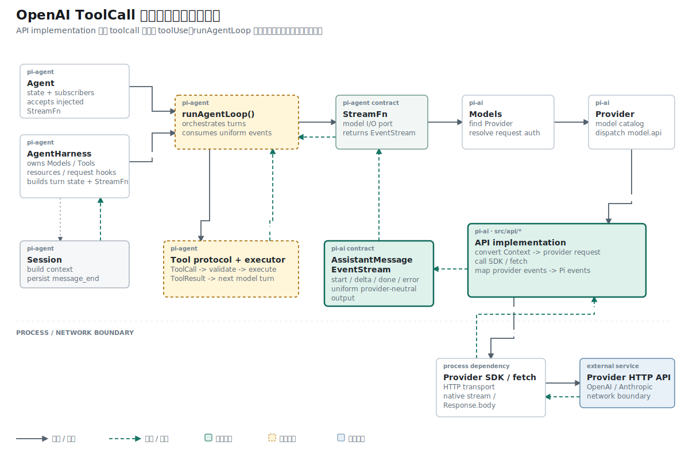

## 结论先行

本篇主张：ToolCall 需要两组互补信号：`toolcall_start/delta/end` 描述形成过程，`stopReason: "toolUse"` 决定 Agent Loop 的下一步控制流。

推理链如下：

```text
前提 1：过程事件只说明参数正在形成。
前提 2：Agent Loop 必须在整条回复结束后决定停止还是执行工具。
结论 1：过程可见性与控制流判定需要不同字段。

前提 3：最终消息只要包含 ToolCall，就仍在等待外部动作。
前提 4：普通 stop 表示该轮已经给出最终回答。
结论 2：包含 ToolCall 的完成消息必须标记为 toolUse。
```

## 已知事实：ToolCall 已形成，但控制流仍然含糊

ToolCall 状态加入后，`processResponsesStream()` 能生成最终内容块，但 EventStream 中没有工具过程事件。`response.completed` 也固定写入 `stopReason = "stop"`，上层无法判断模型是否在等待工具结果。

## 矛盾：两种不同结果被标成同一个 `stop`

上一阶段的最终 AssistantMessage 已经包含：

```ts
{
  type: "toolCall",
  id: "call_1|fc_1",
  name: "get_weather",
  arguments: { city: "SF" },
}
```

但普通文本回复和工具请求都使用 `stopReason: "stop"`。Agent Loop 看到最终消息后无法决定结束本轮还是执行工具。

## 问题定义：过程信号与终止原因必须分开

Provider 解析需要输出两类信号：

```text
过程：toolcall_start -> toolcall_delta -> toolcall_end
结果：AssistantMessage.stopReason = toolUse
```

过程事件服务增量显示，停止原因决定 Agent Loop 是否进入工具执行分支。

## 机制：发布过程事件并计算停止原因

function call item 建立时发布开始事件，参数 delta 到达时发布新增字符串，item 完成时发布稳定 ToolCall：

```ts
stream.push({
  type: "toolcall_end",
  contentIndex: slot.contentIndex,
  toolCall: slot.block,
  partial: output,
});
```

整条响应完成时，解析器检查内容块：

```ts
output.stopReason = output.content.some(
  (block) => block.type === "toolCall",
) ? "toolUse" : "stop";
```

`AssistantMessageEvent` 的 `done.reason` 同步扩展为 `"stop" | "toolUse"`。

对应公共类型是：

```ts
export type StopReason = "stop" | "toolUse" | "error";

export type AssistantMessageEvent =
  | { type: "start"; partial: AssistantMessage }
  | { type: "done"; reason: "stop" | "toolUse"; message: AssistantMessage }
  | { type: "error"; reason: "error"; error: AssistantMessage }
  // 其余 progress events 省略
```

## 概念约束：停止原因描述控制状态

`stopReason` 描述模型为什么停止生成：

```text
stop     已经给出最终回答
toolUse  等待调用方执行工具并返回结果
error    请求或解析失败
```

它不负责触发工具执行。wrapper 只把 parser 计算出的 reason 放进 `done`，Agent Loop 再依据消息内容进入工具分支。

如果 AssistantMessage 同时包含文本和 ToolCall，当前实现仍标记 `toolUse`。工具结果追加后，已有文本和 ToolCall 都会作为历史发送到下一轮模型请求。

## 拓扑位置：Provider 表达请求，Agent Loop 执行动作

API implementation 到这里完成“表达工具请求”。参考 Pi 的下一段运行路径位于 `runAgentLoop()`：

```text
AssistantMessage(toolUse)
  -> validate ToolCall arguments
  -> execute local tool
  -> append ToolResult
  -> next model turn
```

Adapter 不应引用本地工具注册表。工具执行也不应读取 OpenAI 的 `function_call` 事件。

## 因果链：`toolUse` 怎样进入下一轮工具执行

这一阶段先在纯 Provider event 测试中得到 `toolUse`，网络 wrapper 尚未接入 parser。第十篇完成接线后，当前仓库才由 wrapper 发出请求、处理 SSE，并把最终消息放进 `done`：

```ts
const response = await fetch(url, requestInit);
await processResponsesStream(
  parseResponsesSse(response),
  output,
  stream,
  model,
);

stream.push({
  type: "done",
  reason: output.stopReason,
  message: output,
});
```

网络请求结束后，wrapper 仍然返回普通 `AssistantMessage`。区别在于 `content` 包含 ToolCall，`stopReason` 为 `toolUse`：

```ts
{
  role: "assistant",
  content: [{
    type: "toolCall",
    id: "call_1|fc_1",
    name: "get_weather",
    arguments: { city: "SF" },
  }],
  stopReason: "toolUse",
}
```

参考 Pi 的 `runAgentLoop()` 从最终消息中筛出 ToolCall，再进入执行器：

```ts
const toolCalls = assistantMessage.content.filter(
  (content) => content.type === "toolCall",
);

const executed = await executeToolCalls(
  currentContext,
  assistantMessage,
  config,
  signal,
  emit,
);
```

执行器验证参数、调用本地工具并创建 `ToolResultMessage`。随后 Agent Loop 把结果追加到 Context，开始下一次模型网络请求。当前项目只做到第一段网络响应的 ToolCall 表示。

参考 Pi 还支持顺序或并行执行多个工具，并在每个工具前后发布 `tool_execution_start/end`。这些事件属于 Agent Runtime，Provider Adapter 的 `toolcall_*` 只描述模型输出。

## 证据边界：事件序列与最终原因同时验证

默认用例 `processResponsesStream emits tool call progress events` 读取同一个 EventStream，记录工具参数形成期间的通知。

事件测试断言完整顺序：

```ts
assert.deepEqual(seen, [
  "toolcall_start",
  "toolcall_delta",
  "toolcall_delta",
  "toolcall_end",
]);
```

同一组 Provider 事件还断言最终状态：

```ts
assert.equal(output.stopReason, "toolUse");
```

## 推理复核

| 结论 | 推理方式 | 当前证据 |
| --- | --- | --- |
| ToolCall 形成过程可以被观察 | 事件序列验证 | start、两个 delta、end 顺序固定 |
| 包含 ToolCall 的消息进入 `toolUse` | 条件演绎 | `content.some(...)` 与测试断言 |
| `toolUse` 会自动执行本地函数 | 不成立 | 当前仓库没有 Agent Loop 和工具执行器 |
| Provider Adapter 应验证所有工具参数 | 不成立 | 参数 schema 属于 Agent Runtime 的工具边界 |

这里必须保持概念同一：`toolcall_*` 是模型输出事件，`tool_execution_*` 才是本地执行事件。

## 结果与当前阶段

OpenAI Adapter 已能同时提供 ToolCall 最终表示、参数过程事件和 `toolUse` 停止原因。当前项目缺少 Tool schema、ToolResult、参数校验和 Agent Loop，尚不能执行工具或发起下一次模型调用。

下一篇回到 Adapter 外层，把已经完成的消息转换、文本解析和 ToolCall 解析接入同一次 HTTP SSE 请求。

## 复现资料

- 实现：`packages/ai/src/api/openai-responses-shared.ts`、`packages/ai/src/types.ts`
- 测试：`packages/ai/test/openai-responses-stream.test.ts`
- 参考：`~/remake-pi/pi/packages/agent/src/agent-loop.ts`
- 验证：`npm test -- packages/ai/test/openai-responses-stream.test.ts`
