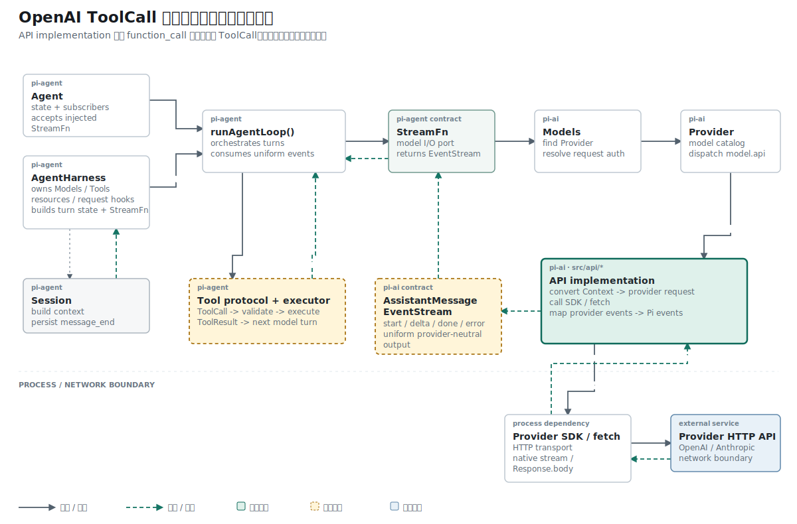

## 名词约定：模型请求工具与本地执行是两件事

| 名称 | 本文含义 |
| --- | --- |
| ToolCall | 模型输出的结构化动作请求，包含工具 ID、名称与参数 |
| argument delta | Provider 分批发送的一段参数 JSON 文本 |
| scratch buffer | 只在流式解析期间存在的临时字符串；这里是 `partialJson` |
| stable state | 可以写入最终 AssistantMessage 的已解析参数对象 |
| Adapter / API implementation | 把 OpenAI `function_call` 事件转换成 Pi ToolCall 的协议模块，不负责执行工具 |

ToolCall 只表达“模型要求调用什么”。工具查找、参数校验和函数执行属于后续 Agent Loop。

## 结论先行

本篇主张：ToolCall 的参数在 `output_item.done` 之前只能作为临时 JSON 字符串保存；稳定的 `arguments` 对象只能在完成边界上建立。

推理链如下：

```text
前提 1：工具参数通过多个 delta 到达。
前提 2：任意中间 delta 拼接结果都可能不是合法 JSON。
结论 1：中间状态不能写入要求合法对象的 arguments 字段。

前提 3：多个 function_call 可以交错传输。
前提 4：每个调用都有独立的 output_index。
结论 2：解析器必须按 output_index 隔离 partialJson、ToolCall 和 contentIndex。
```

## 已知事实：function_call 的中间状态不是合法参数对象

OpenAI Responses 把工具调用表示为 `function_call` output item。参数通过多个 `response.function_call_arguments.delta` 到达，中间字符串可能只有 `{"city"`，此时不能执行 `JSON.parse()`。

## 矛盾：文本可以随时成立，JSON 参数不能

文本 delta 可以立即追加到字符串，并且每个中间字符串都是合法文本。工具参数的中间状态可能是：

```text
{"city"
{"city":"SF"}
```

第一行不是完整 JSON。把它写入稳定的 `arguments: Record<string, unknown>` 会迫使类型接受非法中间值。解析器需要额外的 scratch buffer，并在 item 完成时才生成稳定参数。

## 问题定义：稳定状态与临时状态如何共存

解析器需要同时保存稳定消息和临时传输状态：

```text
稳定状态：ToolCall { id, name, arguments }
临时状态：partialJson
定位信息：output_index -> contentIndex
```

多个工具调用可能交错出现，单个全局字符串无法区分它们。

## 机制：toolCallSlots 隔离形成中的调用

消息协议先允许 AssistantMessage 包含 `ToolCall`：

```ts
export interface ToolCall {
  type: "toolCall";
  id: string;
  name: string;
  arguments: Record<string, unknown>;
}
```

解析器为每个 function call 建立 slot：

```ts
type OpenAIFunctionCallItem = {
  type: "function_call";
  id: string;
  call_id: string;
  name: string;
  arguments?: string;
};

type OpenAIMessageItem = {
  type: "message";
  content?: { type: string; text?: string }[];
};

const toolCallSlots = new Map<
  number,
  { block: ToolCall; contentIndex: number; partialJson: string }
>();
```

delta 只追加字符串：

```ts
const slot = toolCallSlots.get(event.output_index);
if (slot) slot.partialJson += event.delta;
```

`response.output_item.done` 到达后才生成稳定参数：

```ts
slot.block.arguments = JSON.parse(
  event.item.arguments || slot.partialJson || "{}",
) as Record<string, unknown>;
```

随后删除 slot，避免完成后的 delta 继续修改该调用。

`AssistantMessage.content` 也从 `TextContent[]` 扩展为 `(TextContent | ToolCall)[]`。这项类型变化迫使出站消息转换显式筛选 `TextContent`；当前请求侧不会把 ToolCall 误当成文本，也还没有实现工具历史重放。

## 身份约束：内部 ID 必须保留两个 Provider 标识

OpenAI function call item 同时给出 `id` 和 `call_id`：

```ts
item: {
  type: "function_call",
  id: "fc_1",
  call_id: "call_1",
  name: "get_weather",
}
```

当前实现把它们组合成内部 ID：

```ts
id: `${event.item.call_id}|${event.item.id}`
```

`call_id` 用于后续工具结果关联，item `id` 保留 Provider 输出项身份。学习实现尚未拥有 ToolResult，但先保留两个值可以避免后续重放请求时丢失关联信息。

## 不变式：每个 output_index 只修改自己的 slot

每个 slot 以 `output_index` 为键。两个工具调用交错发送 delta 时，各自追加自己的 `partialJson`：

```text
output_index 0 -> get_weather -> {"city":"SF"}
output_index 1 -> get_time    -> {"zone":"UTC"}
```

完成一个 item 只删除对应 slot，不影响仍在接收参数的其他调用。

## 拓扑位置：Adapter 只表达工具请求

API implementation 负责把 Provider 的 `function_call` 转成 Pi `ToolCall`。它不查找本地工具，也不执行函数。参考 Pi 的 `runAgentLoop()` 在收到最终 AssistantMessage 后，才进行工具查找、参数验证、执行和 ToolResult 追加。

## 因果链：参数 delta 怎样从网络形成 ToolCall

ToolCall 状态刚加入时，输入来自测试中的 `toolCallEvents()` 异步生成器；当时 OpenAI wrapper 仍读取最终 JSON。第十篇接入 SSE 后，当前仓库才由 `fetch()` 把线上事件送进同一个解析函数：

```ts
const response = await fetch(url, requestInit);

await processResponsesStream(
  parseResponsesSse(response),
  output,
  stream,
  model,
);
```

OpenAI 会通过 SSE 发送 function call item 和参数 delta：

```text
data: {"type":"response.output_item.added","output_index":0,
       "item":{"type":"function_call","id":"fc_1",
               "call_id":"call_1","name":"get_weather","arguments":""}}

data: {"type":"response.function_call_arguments.delta",
       "output_index":0,"delta":"{\"city\""}

data: {"type":"response.function_call_arguments.delta",
       "output_index":0,"delta":":\"SF\"}"}
```

wrapper 把 SSE data 解析成对象后，`toolCallSlots` 负责跨事件保存状态：

```ts
toolCallSlots.set(event.output_index, {
  block,
  contentIndex: output.content.length - 1,
  partialJson: event.item.arguments ?? "",
});
```

`output_item.done` 提供最终边界。只有这时才把字符串转成对象：

```ts
slot.block.arguments = JSON.parse(
  event.item.arguments || slot.partialJson || "{}",
);
```

网络分帧只保证 event 完整，无法保证每个参数 delta 是合法 JSON。`partialJson` 因此属于 Provider 流解析期间的临时状态。

## 证据边界：故意拆开的 JSON 最终恢复为对象

默认用例 `processResponsesStream converts OpenAI function call into toolCall block` 覆盖 function call 的完整形成过程。

测试把参数拆成两个 delta：

```ts
yield { type: "response.function_call_arguments.delta", delta: '{"city"' };
yield { type: "response.function_call_arguments.delta", delta: ':"SF"}' };
```

完成后断言内部内容块：

```ts
assert.deepEqual(output.content, [{
  type: "toolCall",
  id: "call_1|fc_1",
  name: "get_weather",
  arguments: { city: "SF" },
}]);
```

## 适用范围：reasoning、schema 校验和解析失败

Responses 还会发送 reasoning item。类型联合加入了 `type: "reasoning"`，解析器明确跳过未支持项，避免按 message 路径读取不存在的字段。

```ts
type OpenAIUnsupportedItem = {
  type: "reasoning";
};

if (event.item.type !== "message") continue;
```

`OpenAIUnsupportedItem` 让 TypeScript 知道 reasoning 是合法 Provider item；守卫让当前阶段只为 message 建立文本 slot。

当前 `JSON.parse()` 失败会终止整条流；解析完成后也没有根据工具 schema 检查字段类型。这些职责分别属于 Provider 错误处理和后续 Tool Protocol。

## 推理复核

| 结论 | 推理方式 | 当前证据 |
| --- | --- | --- |
| 不完整参数必须保存在 `partialJson` | 反例推导 | 测试第一段参数不是合法 JSON |
| 多个工具调用可以隔离状态 | 数据结构推导 | `toolCallSlots` 以 `output_index` 为键 |
| `JSON.parse()` 成功等同于参数合法 | 不成立 | 尚未按工具 schema 验证字段 |
| ToolCall 已能被本地执行 | 不成立 | Agent Loop、工具注册和 ToolResult 尚未实现 |

本文只证明“Provider 输出可以形成稳定 ToolCall”，没有把表示能力扩大为执行能力。

## 结果与当前阶段

ToolCall 已进入 AssistantMessage，临时 JSON 与稳定参数的生命周期已经分开。项目尚未定义 ToolResult，也没有 Agent Loop，因此工具调用仍停留在“模型提出动作”的表示阶段。

下一篇补齐 toolcall progress events 和 `toolUse` 停止原因，让上层知道这条回复正在等待本地工具。

## 复现资料

- 实现：`packages/ai/src/api/openai-responses-shared.ts`、`packages/ai/src/types.ts`
- 测试：`packages/ai/test/openai-responses-stream.test.ts`
- 参考：`~/remake-pi/pi/packages/ai/src/api/openai-responses-shared.ts`、`~/remake-pi/pi/packages/agent/src/agent-loop.ts`
- 验证：`npm test -- packages/ai/test/openai-responses-stream.test.ts`
