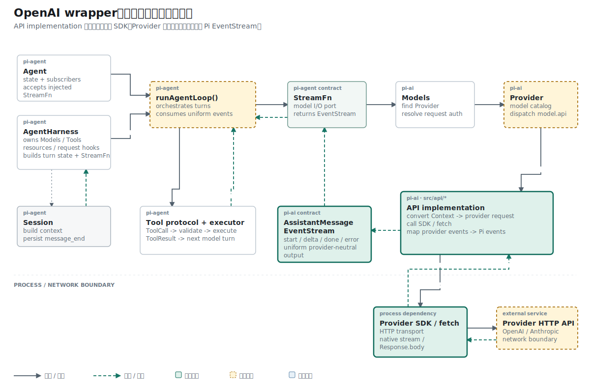

## 名词约定：wrapper 只是协议适配器的外层请求函数

| 名称 | 本文含义 |
| --- | --- |
| API implementation / Adapter | 完整的 OpenAI Responses 协议模块，包含消息转换、网络调用与事件映射 |
| wrapper | Adapter 中包住一次请求生命周期的 `streamSimple()`；它调用下层函数，但不等于整个 Adapter |
| SSE parser | 把 `text/event-stream` 文本帧转换成 OpenAI event 对象的传输解析器 |
| Provider event parser | 把 OpenAI event 对象更新为 AssistantMessage 与 Pi progress event 的状态机 |
| mocked `fetch()` | 测试替身；记录请求并返回本地构造的 Response，不访问外部网络 |

本文的“接线”指 wrapper 依次调用这些独立组件，使数据从 HTTP 请求连续到达 Pi EventStream。

## 结论先行

本篇主张：OpenAI wrapper 应只负责 HTTP 生命周期和传输接线，把 Context 转换与 Provider event 状态机作为独立组件组合起来。

推理链如下：

```text
前提 1：请求构造、SSE 分帧和 OpenAI event 映射拥有不同输入输出。
前提 2：三者已经能够分别测试。
结论 1：wrapper 应通过组合建立运行路径，不应重新实现各层逻辑。

前提 3：只有 wrapper 能观察 HTTP status、response body 和请求异常。
前提 4：只有 Provider event parser 能解释 output_index、delta 和 completed。
结论 2：start/done/error 属于 wrapper，内容状态变化属于 parser。
```

## 已知事实：纯解析器完成后，网络仍走最终 JSON

wrapper 的第一组自动测试替换 `globalThis.fetch`，验证 URL、headers、请求体和最终消息。此时服务端返回的是完整 JSON，`streamSimple()` 仍通过 `res.json()` 一次性读取结果。

文本和工具事件解析器随后在纯异步迭代器上完成，但网络路径没有使用它们。

## 历史事实：旧 wrapper 已经处理请求级归一化

流式接线前，wrapper 已经把 Provider JSON 转成 Pi 消息。`outputText()` 提取文本，`usageFromResponse()` 把 OpenAI Token 字段映射成 `Usage`，`createMessage()` 组合 response ID、模型信息和停止原因：

```ts
const data = (await res.json()) as OpenAIResponsesResponse;
const message = createMessage(
  model,
  outputText(data),
  data,
);
```

异常路径使用 `createErrorMessage()` 生成 `stopReason: "error"` 的 AssistantMessage。后续 SSE 改造保留这些 wrapper 职责，只替换 `res.json()` 到 Provider events 之间的传输方式。

同一文件还定义了协议选项 `OpenAIResponsesOptions` 和最小响应形状 `OpenAIResponsesResponse`。旧请求通过 `promptFromContext()` 只取最后一条 user 消息；上一篇已经把它替换成完整 Context 转换。Provider 使用 `streamSimple`，完整 `stream` 在当前阶段只是同一实现的导出别名：

```ts
export const stream: StreamFunction<
  "openai-responses",
  StreamOptions
> = streamSimple;
```

## 前提：三个独立零件已经通过各自测试

进入这一阶段时，OpenAI Adapter 已经有三段分别通过测试的代码：

```text
convertResponsesMessages()  Context -> Responses input[]
processResponsesStream()    OpenAI events -> AssistantMessage
AssistantMessageEventStream Pi progress + final result
```

网络 wrapper 仍走旧路径：

```text
fetch() -> res.json() -> outputText() -> done
```

接线工作的目标是替换中间传输路径，同时保持 Provider 对外的 `streamSimple()` 签名不变。

## 问题定义：三种数据边界如何连续转换

一次 OpenAI 流式调用经过三种数据：

```text
HTTP Response.body
  -> SSE data 文本
  -> OpenAI event 对象
  -> AssistantMessageEventStream
```

wrapper 需要管理请求开始、HTTP 失败、解析失败和最终 `done/error`。Provider 事件解析器只处理 OpenAI event，不应重复网络职责。

## 机制：用 SSE 转换器替换 `res.json()`

请求体先增加 `stream: true`：

```ts
body: JSON.stringify({
  model: model.id,
  input: convertResponsesMessages(model, context),
  stream: true,
})
```

随后加入传输转换器：

```ts
async function* parseResponsesSse(response: Response) {
  if (!response.body) throw new Error("Missing response body");

  const text = await response.text();
  for (const frame of text.split("\n\n")) {
    const line = frame.split("\n").find((item) => item.startsWith("data:"));
    if (!line) continue;

    const data = line.slice("data:".length).trim();
    if (!data || data === "[DONE]") continue;
    yield JSON.parse(data);
  }
}
```

wrapper 创建空的 `AssistantMessage`，把解析器接到 Provider event 处理器，最后负责推送终止事件：

```ts
await processResponsesStream(parseResponsesSse(res), output, stream, model);
stream.push({ type: "done", reason: output.stopReason, message: output });
stream.end();
```

异常路径统一构造 `stopReason: "error"` 的 AssistantMessage，并推送 `error`。

## 职责演绎：wrapper 为什么拥有 `start/done/error`

纯事件解析器只看到 Provider events。它不知道 `fetch()` 是否返回非 2xx，也不知道 AbortSignal 是否在请求结束后触发。

wrapper 覆盖完整生命周期：

```text
before fetch        push start
HTTP non-2xx        create error message
parser success      push done
parser throw        push error
any terminal path   end stream
```

这个边界避免 `processResponsesStream()` 同时处理 HTTP status、API Key 和 SSE event。

## 网络证据：完整请求怎样执行

下面是当前 `streamSimple()` 中实际访问网络的代码。URL、认证 header、请求体和流式开关都在这里确定：

```ts
const res = await fetch(
  `${model.baseUrl.replace(/\/+$/, "")}/responses`,
  {
    method: "POST",
    headers: {
      authorization: `Bearer ${options.apiKey}`,
      "content-type": "application/json",
    },
    body: JSON.stringify({
      model: model.id,
      input: convertResponsesMessages(model, context),
      stream: true,
    }),
  },
);

if (!res.ok) {
  throw new Error(await res.text());
}
```

等价的 HTTP 请求大致如下，测试中的 key 和模型名都是假值：

```bash
curl https://api.openai.com/v1/responses \
  -X POST \
  -H 'Authorization: Bearer test-key' \
  -H 'Content-Type: application/json' \
  -d '{
    "model": "gpt-test",
    "input": [
      {"role":"system","content":"Be concise."},
      {"role":"user","content":[{"type":"input_text","text":"Hello"}]}
    ],
    "stream": true
  }'
```

服务端返回 `text/event-stream`。当前 parser 期待这样的帧：

```text
data: {"type":"response.output_item.added","output_index":0,"item":{"type":"message"}}

data: {"type":"response.output_text.delta","output_index":0,"delta":"Hel"}

data: {"type":"response.output_text.delta","output_index":0,"delta":"lo"}

data: {"type":"response.completed","response":{"id":"resp_123"}}

```

`parseResponsesSse()` 去掉 `data:` 并执行 `JSON.parse()`。`processResponsesStream()` 再把 OpenAI event 写入 `output` 和 Pi EventStream。wrapper 最后发送 `done`：

```ts
const output = createMessage(model, "");
output.content = [];

await processResponsesStream(
  parseResponsesSse(res),
  output,
  stream,
  model,
);

stream.push({
  type: "done",
  reason: output.stopReason,
  message: output,
});
stream.end();
```

## 拓扑位置：API implementation 同时面向 Provider 和网络

这个 wrapper 位于 API implementation 内，向下调用 SDK 或 `fetch()`，向上返回 `AssistantMessageEventStream`。Provider 只委托调用，Agent Loop 不接触 HTTP Response 或 OpenAI event。

参考 Pi 使用 OpenAI SDK 的 `responses.create(...).withResponse()`，SDK 返回的异步流直接交给 `processResponsesStream()`。当前学习实现用 `fetch()` 保留相同的 Adapter 合同。

参考实现的网络调用集中在这一句：

```ts
const { data: openaiStream, response } = await client.responses
  .create(params, requestOptions)
  .withResponse();
```

SDK 内部仍然执行 HTTP。它额外处理超时、重试、header 合并和流式事件类型。学习实现保留显式 `fetch()`，可以直接观察线上的请求与 SSE 文本。

## 证据边界：mocked fetch 同时检查请求与返回流

第一版测试名称为 `streamSimple sends OpenAI Responses request and returns assistant message`。它先固定非流式 wrapper 的 URL、Bearer Token、请求体和最终消息，再在 SSE 接线提交中扩展为事件序列断言。

测试 helper `sseResponse()` 把 Provider event 数组编码成 `data: ...\n\n` 文本，并返回标准 `Response`。因此 wrapper 接收到的输入仍经过真实的 `response.text()` 与 JSON 解析。

mocked fetch 返回五个 OpenAI SSE 事件，Adapter 将它们转换成六个 Pi 生命周期与文本事件。测试同时检查请求和返回事件：

```ts
assert.equal(requestBody.stream, true);
assert.deepEqual(seen, [
  "start",
  "text_start",
  "text_delta",
  "text_delta",
  "text_end",
  "done",
]);
assert.equal(result.content[0]?.text, "Hello");
```

测试不依赖 API Key 或真实网络，因此可以稳定验证 wrapper 与 parser 的接线。

mocked fetch 还保存 `capturedUrl` 和 `capturedInit`。测试读取 `capturedInit.body`，证明通过测试的消息转换函数确实进入了 HTTP 请求，而不是只在独立单元测试中存在。

## 当前限制：顺序流式不等于实时流式

`response.text()` 会等到整个响应结束后才返回。后续 `yield` 顺序正确，但用户无法在网络传输期间看到增量。当前实现证明了协议闭环，没有证明实时交付。

## 推理复核

| 结论 | 推理方式 | 当前证据 |
| --- | --- | --- |
| HTTP 请求已经使用完整 Context 转换 | 因果链与捕获请求 | 测试读取 `capturedInit.body` |
| OpenAI SSE 已映射为 Pi 事件 | 端到端模拟 | mocked SSE 产生 start、text_*、done |
| 当前用户能实时看到网络 chunk | 不成立 | parser 先等待 `response.text()` |
| SDK 是唯一可行的网络实现 | 不成立 | 原生 fetch 已证明协议闭环，SDK 只是参考 Pi 的实现选择 |

最后两行排除两个过度结论：事件顺序正确不等于传输实时，参考实现也不等于唯一实现。

## 结果与当前阶段

OpenAI 请求、SSE 文本、Provider event 和 Pi EventStream 已经连通。下一步需要像 Anthropic 字节流读取器一样按 `Response.body` chunk 解析，或切换到参考 Pi 的 SDK 异步流。

下一篇开始实现第二个协议族 Anthropic Messages。先从请求参数转换入手，再逐步接入 SSE 字节流与事件映射。

## 复现资料

- 实现：`packages/ai/src/api/openai-responses.ts`
- 测试：`packages/ai/test/openai-responses-wrapper.test.ts`
- 参考：`~/remake-pi/pi/packages/ai/src/api/openai-responses.ts`
- 验证：`npm test -- packages/ai/test/openai-responses-wrapper.test.ts`
