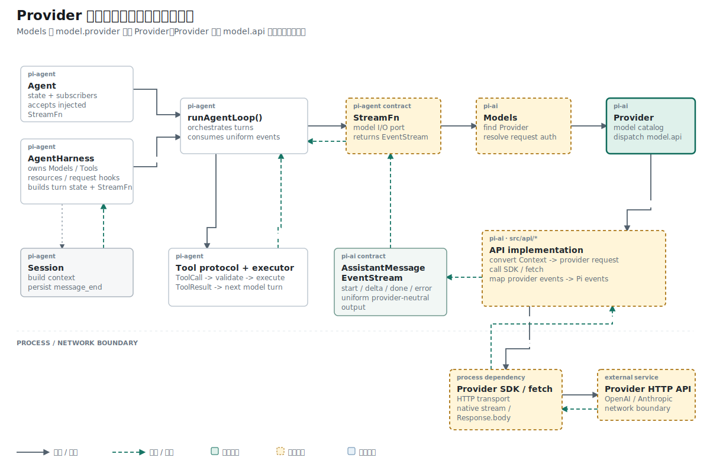

## 结论先行

本篇主张：Provider 应成为模型目录、认证策略与 API implementation 的装配点，而协议转换和 HTTP 仍由 Adapter 承担。

推理链如下：

```text
前提 1：上层调用只应依赖稳定的 stream/streamSimple 合同。
前提 2：OpenAI Responses 与 Anthropic Messages 拥有不同请求和事件协议。
结论 1：协议差异必须封装在各自 API implementation 中。

前提 3：模型目录已经声明 model.api 与 model.provider。
前提 4：调用方若自行选择 Adapter，会重复 Provider 装配知识。
结论 2：Provider 应绑定模型、认证和对应 Adapter，并向上暴露统一委托入口。
```

## 已知事实：第一版 Provider 只能描述，不能调用

`createProvider()` 的第一版只返回 `id`、`name`、Base URL、认证策略和模型目录。Provider 可以回答“有哪些模型”，却没有模型调用入口。

## 前提：三块基础已经存在，但尚未组成路径

前面的改动已经提供三组独立对象：

```text
Model        描述模型、服务商和协议
ApiKeyAuth   把凭证来源解析为请求认证
EventStream  交付过程事件和最终消息
```

但实际调用仍需要手工选择 Adapter：

```ts
const model = openaiProvider().getModels()[0]!;
const stream = openAIResponsesApi().streamSimple(
  model,
  context,
  { apiKey },
);
```

调用方同时知道 Provider 工厂和 API 模块，新增服务商时会把装配逻辑散到 CLI、测试和未来的 Agent 入口。

## 问题定义：稳定入口与协议差异如何同时保留

上层需要稳定调用形状：

```ts
provider.streamSimple(model, context, options)
```

OpenAI Responses 与 Anthropic Messages 的请求体和流事件不同。Provider 应负责装配协议实现，不应把协议转换复制进每个服务商文件。

完整调用允许协议专用选项，所以 `stream()` 使用 `ApiStreamOptions<TApi>`；最小调用使用 `SimpleStreamOptions`。两者都由 `ProviderStreams` 约束为返回同一种 `AssistantMessageEventStream`。

## 机制一：ProviderStreams 固定调用合同

EventStream 引入后，`Provider` 增加两个调用方法，`CreateProviderOptions` 增加 `api: ProviderStreams`：

```ts
export interface ProviderStreams {
  stream(model, context, options?): AssistantMessageEventStream;
  streamSimple(model, context, options?): AssistantMessageEventStream;
}
```

工厂只做委托：

```ts
export function createProvider<TApi extends Api>(input: CreateProviderOptions<TApi>) {
  return {
    id: input.id,
    name: input.name ?? input.id,
    auth: input.auth,
    getModels: () => input.models,
    stream: (model, context, options) =>
      input.api.stream(model, context, options),
    streamSimple: (model, context, options) =>
      input.api.streamSimple(model, context, options),
  };
}
```

OpenAI Provider 注入 `openAIResponsesApi()`，MiniMax Provider 注入 `anthropicMessagesApi()`。Provider 文件只保留服务商配置和装配关系。

## 机制二：从模型查询扩展到模型调用

第一版接口只有模型查询：

```ts
export interface Provider<TApi extends Api = Api> {
  readonly id: string;
  readonly name: string;
  readonly baseUrl?: string;
  readonly headers?: ProviderHeaders;
  readonly auth: ProviderAuth;
  getModels(): readonly Model<TApi>[];
}
```

EventStream 出现后，Provider 增加调用能力：

```ts
export interface Provider<TApi extends Api = Api> {
  // metadata + auth + getModels()

  stream<T extends TApi>(
    model: Model<T>,
    context: Context,
    options?: ApiStreamOptions<T>,
  ): AssistantMessageEventStream;

  streamSimple(
    model: Model<TApi>,
    context: Context,
    options?: SimpleStreamOptions,
  ): AssistantMessageEventStream;
}
```

泛型 `TApi` 把模型目录和 Adapter 协议约束在一起。`Provider<"openai-responses">` 的模型不能在类型层面冒充 `anthropic-messages`。

## 类型证据：模型目录怎样锁定协议

OpenAI 与 MiniMax 的目录都使用 `satisfies Model<TApi>` 检查字段：

```ts
export const OPENAI_MODELS = {
  "gpt-5.4-mini": {
    api: "openai-responses",
    provider: "openai",
    // 其余模型字段省略
  } satisfies Model<"openai-responses">,
};

export const MINIMAX_MODELS = {
  "MiniMax-M3": {
    api: "anthropic-messages",
    provider: "minimax",
    // 其余模型字段省略
  } satisfies Model<"anthropic-messages">,
};
```

目录保存“模型使用哪种协议”，Provider 工厂保存“这项协议由哪个 Adapter 实现”。MiniMax 的认证策略同时声明 `MINIMAX_API_KEY`，模型与凭证来源都留在服务商装配文件中。

## 拓扑位置：Models 与 API implementation 之间

参考 Pi 的调用顺序是：

```text
Models -> Provider -> ProviderStreams -> API implementation
```

参考实现的 `createProvider()` 还支持两种 `api` 输入：单个 `ProviderStreams`，或按 `model.api` 建立的实现表。当前项目只实现单个 `ProviderStreams`，因此一个 Provider 暂时不能同时包含多种 API 模型。

## 因果链：Provider 委托怎样到达网络

OpenAI Provider 在创建时把 Responses Adapter 作为运行时依赖传入：

```ts
export function openaiProvider(): Provider<"openai-responses"> {
  return createProvider({
    id: "openai",
    name: "OpenAI",
    baseUrl: "https://api.openai.com/v1",
    auth: {
      apiKey: envApiKeyAuth("OpenAI API key", ["OPENAI_API_KEY"]),
    },
    models: Object.values(OPENAI_MODELS),
    api: openAIResponsesApi(),
  });
}
```

`openAIResponsesApi()` 返回模块中的 `stream()` 和 `streamSimple()`。`createProvider()` 没有网络代码，只把参数原样转交：

```ts
streamSimple: (model, context, options) =>
  input.api.streamSimple(model, context, options),
```

下一跳进入 `api/openai-responses.ts`，网络请求才发生：

```ts
const res = await fetch(
  `${model.baseUrl.replace(/\/+$/, "")}/responses`,
  requestInit,
);
```

MiniMax 的装配方向相同，只把 `api` 换成 `anthropicMessagesApi()`。新增兼容服务商时，Agent Loop 不需要出现 `if (provider === "minimax")`。

两个 `*.lazy.ts` 文件把模块导出收敛成 `ProviderStreams`：

```ts
export const openAIResponsesApi = (): ProviderStreams =>
  openAIResponses;

export const anthropicMessagesApi = (): ProviderStreams =>
  anthropicMessages;
```

当前函数没有延迟执行网络；它们提供统一的 Adapter 对象形状，并避免 Provider 文件直接挑选模块内的函数。

## 证据边界：目录和认证已测，委托仍缺回归

两项默认测试分别命名为：

```text
openaiProvider exposes model catalog and auth
minimaxProvider exposes Anthropic-style model catalog and auth
```

自动测试验证 Provider 的模型目录和认证装配：

```ts
const provider = minimaxProvider();
const model = provider.getModels()[0];

assert.equal(provider.id, "minimax");
assert.equal(model?.provider, "minimax");
assert.equal(model?.api, "anthropic-messages");
```

当前默认测试没有通过 `provider.streamSimple()` 证明 Adapter 委托。OpenAI wrapper 与 Anthropic 转换测试分别验证了 Adapter 自身，但 Provider 到 Adapter 的自动回归仍是空缺。

历史 smoke 脚本曾使用 `provider.streamSimple(...).result()` 发起真实 OpenAI 请求，并允许 `OPENAI_BASE_URL` 与 `OPENAI_API_KEY` 覆盖模型配置。它证明过委托可以到达网络，但依赖本机凭证，因此没有成为默认回归测试。

脚本把调用放在异步 `main()` 中，最终只打印模型文本；它没有捕获请求参数或断言 Adapter 身份。

## 缺失前提：Provider 不能替代 Models

Provider 解决了一个服务商内部的装配，但调用方仍要自己持有 Provider 实例。参考 Pi 的 `Models` 集合承担更高一层职责：

```text
register providers
find provider by model.provider
resolve request auth
delegate stream / streamSimple
refresh dynamic model catalogs
```

当前仓库尚未实现 `Models`，所以拓扑图中的 Models 仍是后续节点。Provider 已经具备被注册和委托的形状。

## 推理复核

| 结论 | 推理方式 | 当前证据 |
| --- | --- | --- |
| Provider 可以统一 OpenAI 与 MiniMax 的调用形状 | 类型与构造证据 | 两个工厂都返回 `Provider` 并注入 `ProviderStreams` |
| Provider 自己实现 HTTP | 不成立 | `createProvider()` 只委托，`fetch()` 位于 API implementation |
| `model.api` 已支持同一 Provider 内多协议分派 | 不成立 | 当前工厂只接收一个 `ProviderStreams` |
| 上层无需知道具体 Provider 实例 | 尚未成立 | `Models` 集合未实现 |

这些结论把“统一接口”“协议实现”和“全局注册”限定为三个不同职责，避免用 Provider 一个名称覆盖整条调用链。

## 结果与当前阶段

Provider 已从静态描述对象扩展为调用装配点。项目仍缺参考 Pi 的 `Models` 集合、认证自动注入、多 API 分派和针对 Provider 委托的聚焦测试。

下一篇进入 OpenAI Adapter 内部，处理 Agent Context 到 Responses `input[]` 的第一次完整转换。

## 复现资料

- 实现：`packages/ai/src/models.ts`
- 装配：`packages/ai/src/providers/openai.ts`、`packages/ai/src/providers/minimax.ts`
- 测试：`packages/ai/test/provider.test.ts`
- 参考：`~/remake-pi/pi/packages/ai/src/models.ts`
- 验证：`npm test -- packages/ai/test/provider.test.ts`
